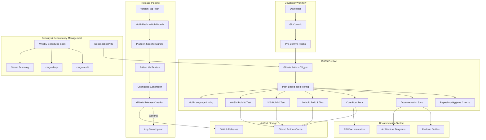

# Design Document: Repository Production Readiness and Hygiene

## Overview

This design establishes a comprehensive production readiness infrastructure for the SCMessenger repository, transforming it from an alpha-stage project with failing CI/CD into a world-class, release-ready codebase. The system addresses 13 critical areas: CI/CD reliability, automated multi-platform releases, non-regression protection, dependency security, documentation quality, multi-language code quality enforcement, build reproducibility, version management, security hardening, repository hygiene, platform-specific deployment, community engagement, and parser testing.

**Current State**: SCMessenger v0.2.1 (alpha) with 820+ unit tests, 14 integration tests, Rust workspace (core, mobile, cli, wasm), Android (Kotlin/Gradle), iOS (Swift/Xcode), WASM (wasm-bindgen). GitHub Actions workflows exist but fail frequently. No automated release pipeline. Free tier GitHub account (2000 CI/CD minutes/month, no private security advisories, no required reviewers).

**Design Philosophy**: 
- **Truly Sovereign**: No external services beyond GitHub (no CircleCI, no external artifact storage, no third-party security scanning services)
- **Free Tier Optimized**: Aggressive caching, conditional job execution, workflow optimization to stay within 2000 minutes/month
- **Solo Developer + AI**: Automation over manual processes, clear documentation, self-service tooling
- **Priority**: Android/Windows/Core first, then WASM, then iOS
- **Top Priority**: Non-regression protection (comprehensive testing, pre-commit hooks, branch protection)

**Key Design Decisions**:
1. **Monolithic CI Workflow**: Single `ci.yml` with conditional job execution based on changed files to minimize redundant builds
2. **GitHub-Native Artifact Storage**: Use GitHub Releases for all artifacts (no S3, no external CDN)
3. **Cargo Workspace Caching**: Aggressive Swatinem/rust-cache usage with matrix-based cache keys
4. **Property-Based Testing**: Mandatory for all parsers, serializers, and cryptographic operations
5. **Pre-Commit Hooks**: Local enforcement before CI to catch issues early and save CI minutes
6. **Version Single Source of Truth**: Cargo.toml workspace.package.version drives all platform versions
7. **Security Scanning**: Weekly scheduled workflows (not on every PR) to conserve CI minutes
8. **Platform-Specific Signing**: GitHub Secrets for keystores/certificates, fallback to debug signing for CI


## Architecture

### High-Level System Architecture



### Component Interaction Flow

**1. Developer Commit Flow**:
```
Developer writes code
  → Pre-commit hook runs (fmt, clippy, unit tests)
  → Commit created
  → Push to GitHub
  → GitHub Actions triggered
  → Path-based filtering determines which jobs run
  → Jobs execute in parallel
  → Status checks reported to PR
  → Merge allowed only if all checks pass
```

**2. Release Flow**:
```
Maintainer updates version in Cargo.toml
  → Version sync script updates Android/iOS/WASM versions
  → Commit and push
  → Create git tag (v0.2.2)
  → Push tag
  → Release workflow triggered
  → Build matrix executes (Linux, macOS, Windows, Android, iOS, WASM)
  → Platform-specific signing applied
  → Checksums generated
  → Changelog extracted from commits
  → GitHub Release created with all artifacts
  → Optional: Upload to app stores
```

**3. Dependency Update Flow**:
```
Dependabot detects new version
  → Creates PR with updated Cargo.lock/build.gradle
  → CI runs full test suite
  → cargo-audit checks for vulnerabilities
  → cargo-deny checks license compatibility
  → Manual review and merge
```

**4. Security Scan Flow**:
```
Weekly cron trigger
  → cargo-audit scans Rust dependencies
  → cargo-deny validates licenses
  → gitleaks scans for secrets
  → Results posted as GitHub issues
  → Security label applied
  → Maintainer triages and resolves
```


## Components and Interfaces

### 1. CI/CD Reliability System

**Purpose**: Ensure GitHub Actions workflows pass consistently with optimized resource usage.

**Components**:
- **Workflow Orchestrator** (`ci.yml`): Main CI workflow with path-based job filtering
- **Cache Manager**: Swatinem/rust-cache with matrix-specific keys
- **Retry Handler**: Automatic retry logic for transient network failures
- **Timeout Manager**: Per-job timeout configuration (30 minutes max)
- **Resource Monitor**: Tracks CI minute usage against free tier limits

**Interfaces**:
```yaml
# ci.yml structure
on:
  push:
    branches: [main]
  pull_request:
    branches: [main]

jobs:
  path-filter:
    outputs:
      core: ${{ steps.filter.outputs.core }}
      android: ${{ steps.filter.outputs.android }}
      ios: ${{ steps.filter.outputs.ios }}
      wasm: ${{ steps.filter.outputs.wasm }}
      docs: ${{ steps.filter.outputs.docs }}
  
  check-core:
    needs: path-filter
    if: needs.path-filter.outputs.core == 'true'
    # ... core checks
  
  check-android:
    needs: path-filter
    if: needs.path-filter.outputs.android == 'true'
    # ... android checks
```

**Key Optimizations**:
- **Path-based filtering**: Only run jobs for changed code paths
- **Aggressive caching**: Cache Rust target/, Gradle ~/.gradle, CocoaPods ~/Library/Caches/CocoaPods
- **Parallel execution**: All platform checks run in parallel
- **Conditional steps**: Skip expensive steps (integration tests) on doc-only changes
- **Retry logic**: Use `nick-fields/retry@v2` for network-dependent steps

**Configuration**:
```yaml
# Cache configuration
- uses: Swatinem/rust-cache@v2
  with:
    key: ${{ matrix.os }}-${{ matrix.target }}-${{ hashFiles('**/Cargo.lock') }}
    cache-on-failure: true
    save-if: ${{ github.ref == 'refs/heads/main' }}

# Retry configuration
- uses: nick-fields/retry@v2
  with:
    timeout_minutes: 10
    max_attempts: 3
    retry_on: error
    command: cargo test --workspace
```

### 2. Release Pipeline System

**Purpose**: Automate multi-platform binary builds and distribution.

**Components**:
- **Build Matrix Orchestrator**: Manages parallel builds across platforms
- **Platform Builders**: Specialized builders for each target (CLI, Android, iOS, WASM)
- **Signing Manager**: Handles platform-specific code signing
- **Artifact Collector**: Gathers and verifies all build outputs
- **Changelog Generator**: Extracts commits and formats release notes
- **Release Publisher**: Creates GitHub Release with artifacts

**Interfaces**:
```yaml
# release.yml structure
on:
  push:
    tags:
      - v*

jobs:
  build-cli:
    strategy:
      matrix:
        include:
          - os: ubuntu-latest
            target: x86_64-unknown-linux-gnu
          - os: macos-14
            target: x86_64-apple-darwin
          - os: macos-14
            target: aarch64-apple-darwin
          - os: windows-latest
            target: x86_64-pc-windows-msvc
    steps:
      - uses: actions/checkout@v4
      - uses: dtolnay/rust-toolchain@stable
        with:
          targets: ${{ matrix.target }}
      - run: cargo build --release --bin scmessenger-cli --target ${{ matrix.target }}
      - run: sha256sum target/${{ matrix.target }}/release/scmessenger-cli > checksum.txt
      - uses: actions/upload-artifact@v4
        with:
          name: cli-${{ matrix.target }}
          path: |
            target/${{ matrix.target }}/release/scmessenger-cli
            checksum.txt
  
  build-android:
    steps:
      - uses: actions/checkout@v4
      - uses: android-actions/setup-android@v3
      - uses: nttld/setup-ndk@v1
        with:
          ndk-version: r26b
      - name: Decode keystore
        run: echo "${{ secrets.ANDROID_KEYSTORE_BASE64 }}" | base64 -d > release.keystore
      - name: Build APK and AAB
        env:
          KEYSTORE_FILE: release.keystore
          KEYSTORE_PASSWORD: ${{ secrets.KEYSTORE_PASSWORD }}
          KEYSTORE_ALIAS: ${{ secrets.KEYSTORE_ALIAS }}
          KEY_PASSWORD: ${{ secrets.KEY_PASSWORD }}
        run: |
          cd android
          ./gradlew assembleRelease bundleRelease
      - uses: actions/upload-artifact@v4
        with:
          name: android-release
          path: |
            android/app/build/outputs/apk/release/*.apk
            android/app/build/outputs/bundle/release/*.aab
  
  build-ios:
    runs-on: macos-latest
    steps:
      - uses: actions/checkout@v4
      - name: Import certificates
        env:
          CERTIFICATE_BASE64: ${{ secrets.IOS_CERTIFICATE_BASE64 }}
          CERTIFICATE_PASSWORD: ${{ secrets.IOS_CERTIFICATE_PASSWORD }}
          PROVISIONING_PROFILE_BASE64: ${{ secrets.IOS_PROVISIONING_PROFILE_BASE64 }}
        run: |
          # Import certificate to keychain
          echo "$CERTIFICATE_BASE64" | base64 -d > certificate.p12
          security create-keychain -p "" build.keychain
          security import certificate.p12 -k build.keychain -P "$CERTIFICATE_PASSWORD" -T /usr/bin/codesign
          security set-key-partition-list -S apple-tool:,apple: -s -k "" build.keychain
          # Install provisioning profile
          echo "$PROVISIONING_PROFILE_BASE64" | base64 -d > profile.mobileprovision
          mkdir -p ~/Library/MobileDevice/Provisioning\ Profiles
          cp profile.mobileprovision ~/Library/MobileDevice/Provisioning\ Profiles/
      - name: Build IPA
        run: |
          cd iOS
          xcodebuild -workspace SCMessenger.xcworkspace \
            -scheme SCMessenger \
            -configuration Release \
            -archivePath build/SCMessenger.xcarchive \
            archive
          xcodebuild -exportArchive \
            -archivePath build/SCMessenger.xcarchive \
            -exportPath build \
            -exportOptionsPlist ExportOptions.plist
      - uses: actions/upload-artifact@v4
        with:
          name: ios-release
          path: iOS/build/*.ipa
  
  build-wasm:
    runs-on: ubuntu-latest
    steps:
      - uses: actions/checkout@v4
      - uses: dtolnay/rust-toolchain@stable
        with:
          targets: wasm32-unknown-unknown
      - run: curl https://rustwasm.github.io/wasm-pack/installer/init.sh -sSf | sh
      - run: |
          cd wasm
          wasm-pack build --target web --release
          wasm-opt -Oz pkg/scmessenger_wasm_bg.wasm -o pkg/scmessenger_wasm_bg.wasm
      - uses: actions/upload-artifact@v4
        with:
          name: wasm-release
          path: wasm/pkg/*
  
  create-release:
    needs: [build-cli, build-android, build-ios, build-wasm]
    runs-on: ubuntu-latest
    steps:
      - uses: actions/checkout@v4
        with:
          fetch-depth: 0
      - uses: actions/download-artifact@v4
      - name: Generate changelog
        run: |
          PREV_TAG=$(git describe --tags --abbrev=0 HEAD^)
          git log $PREV_TAG..HEAD --pretty=format:"- %s (%an)" --no-merges > CHANGELOG.md
      - uses: softprops/action-gh-release@v2
        with:
          files: |
            cli-*/*
            android-release/*
            ios-release/*
            wasm-release/*
          body_path: CHANGELOG.md
          draft: false
          prerelease: ${{ contains(github.ref, 'alpha') || contains(github.ref, 'beta') }}
```

**Artifact Verification**:
```bash
# Generate checksums for all artifacts
find . -type f \( -name "*.apk" -o -name "*.aab" -o -name "*.ipa" -o -name "scmessenger-cli*" \) \
  -exec sha256sum {} \; > SHA256SUMS.txt
```

### 3. Test Infrastructure System

**Purpose**: Comprehensive non-regression protection with property-based testing.

**Components**:
- **Pre-Commit Hook Manager**: Git hooks for local enforcement
- **Unit Test Runner**: Executes 820+ unit tests
- **Integration Test Runner**: Executes 14 integration tests with --jobs 1
- **Property Test Framework**: proptest-based round-trip testing
- **Coverage Tracker**: tarpaulin for code coverage measurement
- **Regression Test Registry**: Catalog of bug-specific regression tests

**Interfaces**:
```bash
# .git/hooks/pre-commit
#!/bin/bash
set -e

echo "Running pre-commit checks..."

# Format check
cargo fmt --all -- --check

# Clippy
cargo clippy --workspace -- -D warnings

# Unit tests (fast subset)
cargo test --workspace --lib

echo "Pre-commit checks passed!"
```

```rust
// Property-based test example
use proptest::prelude::*;

proptest! {
    #[test]
    fn test_message_serialization_roundtrip(
        msg in any::<Message>()
    ) {
        let encoded = bincode::serialize(&msg).unwrap();
        let decoded: Message = bincode::deserialize(&encoded).unwrap();
        assert_eq!(msg, decoded);
    }
    
    #[test]
    fn test_encryption_roundtrip(
        plaintext in prop::collection::vec(any::<u8>(), 0..1024)
    ) {
        let key = generate_key();
        let ciphertext = encrypt(&key, &plaintext).unwrap();
        let decrypted = decrypt(&key, &ciphertext).unwrap();
        assert_eq!(plaintext, decrypted);
    }
}
```

**Test Organization**:
```
core/tests/
├── unit/                    # Fast unit tests (< 1s each)
├── integration/             # Integration tests (1-10s each)
├── property/                # Property-based tests (100+ iterations)
└── regression/              # Bug-specific regression tests
    ├── issue_42_timing_attack.rs
    ├── issue_67_race_condition.rs
    └── ...
```

**Coverage Configuration**:
```toml
# .tarpaulin.toml
[report]
out = ["Html", "Lcov"]
output-dir = "target/coverage"

[coverage]
exclude-files = [
    "*/tests/*",
    "*/benches/*",
    "*/examples/*",
]

[thresholds]
line = 80
branch = 70
```

### 4. Dependency Security System

**Purpose**: Automated vulnerability detection and license compliance.

**Components**:
- **Vulnerability Scanner** (cargo-audit): Checks RustSec advisory database
- **License Validator** (cargo-deny): Enforces license policy
- **Secret Scanner** (gitleaks): Detects hardcoded secrets
- **Dependency Update Manager** (dependabot): Automated dependency PRs
- **Supply Chain Auditor**: Maintains audit log in deny.toml

**Interfaces**:
```yaml
# .github/workflows/security.yml
name: Security Scan

on:
  schedule:
    - cron: '0 0 * * 0'  # Weekly on Sunday
  workflow_dispatch:

jobs:
  audit:
    runs-on: ubuntu-latest
    steps:
      - uses: actions/checkout@v4
      - uses: dtolnay/rust-toolchain@stable
      - run: cargo install cargo-audit cargo-deny
      - name: Audit dependencies
        run: cargo audit --json > audit-report.json
      - name: Check licenses
        run: cargo deny check licenses
      - name: Create issue if vulnerabilities found
        if: failure()
        uses: actions/github-script@v7
        with:
          script: |
            const fs = require('fs');
            const report = JSON.parse(fs.readFileSync('audit-report.json', 'utf8'));
            const vulns = report.vulnerabilities.vulnerabilities;
            if (vulns.length > 0) {
              const body = vulns.map(v => 
                `- **${v.advisory.id}**: ${v.advisory.title} (${v.versions.patched.join(', ')})`
              ).join('\n');
              await github.rest.issues.create({
                owner: context.repo.owner,
                repo: context.repo.repo,
                title: `Security: ${vulns.length} vulnerabilities detected`,
                body: `## Vulnerabilities\n\n${body}`,
                labels: ['security', 'dependencies']
              });
            }
  
  secrets:
    runs-on: ubuntu-latest
    steps:
      - uses: actions/checkout@v4
        with:
          fetch-depth: 0
      - uses: gitleaks/gitleaks-action@v2
        env:
          GITHUB_TOKEN: ${{ secrets.GITHUB_TOKEN }}
```

```toml
# deny.toml (enhanced)
[advisories]
db-path = "~/.cargo/advisory-db"
db-urls = ["https://github.com/RustSec/advisory-db"]
vulnerability = "deny"
unmaintained = "warn"
yanked = "deny"
notice = "warn"

[licenses]
unlicensed = "deny"
allow = [
    "MIT",
    "Apache-2.0",
    "BSD-3-Clause",
    "ISC",
    "Unicode-3.0",
    "MPL-2.0",
]
deny = [
    "GPL-2.0",
    "GPL-3.0",
    "AGPL-3.0",
]

[[licenses.clarify]]
name = "ring"
expression = "MIT AND ISC AND OpenSSL"
license-files = [
    { path = "LICENSE", hash = 0xbd0eed23 }
]

[bans]
multiple-versions = "warn"
wildcards = "deny"
highlight = "all"

[[bans.skip]]
name = "windows-sys"
version = "*"

[sources]
unknown-registry = "deny"
unknown-git = "deny"
allow-registry = ["https://github.com/rust-lang/crates.io-index"]
```


### 5. Documentation System

**Purpose**: Maintain accurate, comprehensive, and synchronized documentation.

**Components**:
- **API Documentation Generator** (cargo doc): Rust API docs
- **Documentation Sync Checker** (docs_sync_check.sh): Validates consistency
- **Architecture Diagram Manager**: Mermaid diagrams in docs/
- **Platform Guide Manager**: Setup guides for each platform
- **Link Validator**: Checks all markdown links

**Interfaces**:
```bash
# scripts/docs_sync_check.sh (enhanced)
#!/usr/bin/env bash
set -euo pipefail

FAILED=0

# Check required header fields
check_header_fields() {
  local file="$1"
  if ! grep -qE '^Status:' "$file"; then
    echo "ERROR: $file missing Status header"
    FAILED=1
  fi
  if ! grep -qE '^Last updated:' "$file"; then
    echo "ERROR: $file missing Last updated header"
    FAILED=1
  fi
}

# Validate markdown links
check_links() {
  local file="$1"
  while IFS= read -r link; do
    if [[ ! -e "$link" && ! "$link" =~ ^https?:// ]]; then
      echo "ERROR: Broken link in $file: $link"
      FAILED=1
    fi
  done < <(grep -oP '\[.*?\]\(\K[^)]+' "$file")
}

# Check for machine-local paths
check_no_local_paths() {
  local file="$1"
  if grep -qE '/Users/|/home/[^/]+/|[A-Za-z]:\\' "$file"; then
    echo "ERROR: Machine-local path in $file"
    FAILED=1
  fi
}

# Require doc updates when code changes
if [[ "${DOC_SYNC_REQUIRE_DOC_UPDATES:-0}" == "1" ]]; then
  code_changes=$(git diff --name-only "$BASE_REF"...HEAD -- core android iOS wasm mobile cli)
  doc_changes=$(git diff --name-only "$BASE_REF"...HEAD -- README.md docs/ CONTRIBUTING.md)
  
  if [[ -n "$code_changes" && -z "$doc_changes" ]]; then
    echo "ERROR: Code changed but no docs updated"
    FAILED=1
  fi
fi

exit $FAILED
```

**Documentation Structure**:
```
docs/
├── ARCHITECTURE.md           # System architecture overview
├── CURRENT_STATE.md          # Implementation status
├── DEPLOYMENT.md             # Deployment procedures
├── TESTING_GUIDE.md          # Testing strategy and practices
├── platform/
│   ├── ANDROID_SETUP.md      # Android development setup
│   ├── IOS_SETUP.md          # iOS development setup
│   ├── WASM_SETUP.md         # WASM development setup
│   └── CLI_SETUP.md          # CLI development setup
├── troubleshooting/
│   ├── BUILD_ISSUES.md       # Common build problems
│   ├── CI_FAILURES.md        # CI debugging guide
│   └── RUNTIME_ISSUES.md     # Runtime debugging guide
└── diagrams/
    ├── system_architecture.mmd
    ├── release_pipeline.mmd
    └── security_flow.mmd
```

**API Documentation Generation**:
```bash
# scripts/generate_docs.sh
#!/bin/bash
set -e

# Generate Rust API docs
cargo doc --workspace --no-deps --document-private-items

# Generate Android KDoc
cd android
./gradlew dokkaHtml

# Generate iOS documentation
cd ../iOS
jazzy --clean --author "SC Team" --module SCMessenger

# Copy to docs/api/
mkdir -p ../docs/api
cp -r ../target/doc/* ../docs/api/rust/
cp -r android/app/build/dokka/html/* ../docs/api/android/
cp -r iOS/docs/* ../docs/api/ios/
```

### 6. Code Quality Enforcement System

**Purpose**: Consistent code quality across Rust, Kotlin, Swift, and JavaScript.

**Components**:
- **Rust Linter** (clippy): Rust-specific linting
- **Rust Formatter** (rustfmt): Rust code formatting
- **Kotlin Linter** (ktlint): Kotlin style enforcement
- **Swift Linter** (swiftlint): Swift style enforcement
- **JavaScript Linter** (eslint): JS/TS linting
- **Complexity Analyzer**: Cyclomatic complexity checks

**Interfaces**:
```yaml
# .github/workflows/lint.yml
name: Lint

on:
  pull_request:
    branches: [main]

jobs:
  rust:
    runs-on: ubuntu-latest
    steps:
      - uses: actions/checkout@v4
      - uses: dtolnay/rust-toolchain@stable
        with:
          components: rustfmt, clippy
      - run: cargo fmt --all -- --check
      - run: cargo clippy --workspace -- -D warnings -A clippy::empty_line_after_doc_comments
      - name: Check for unwrap() in library code
        run: |
          if rg -n '\.unwrap\(\)' core/src mobile/src --glob '!*test*'; then
            echo "ERROR: unwrap() found in library code. Use ? or expect() instead."
            exit 1
          fi
      - name: Check for println! in library code
        run: |
          if rg -n 'println!' core/src mobile/src --glob '!*test*'; then
            echo "ERROR: println! found in library code. Use tracing macros instead."
            exit 1
          fi
  
  kotlin:
    runs-on: ubuntu-latest
    steps:
      - uses: actions/checkout@v4
      - name: Run ktlint
        run: |
          cd android
          ./gradlew ktlintCheck
  
  swift:
    runs-on: macos-latest
    steps:
      - uses: actions/checkout@v4
      - name: Install swiftlint
        run: brew install swiftlint
      - name: Run swiftlint
        run: |
          cd iOS
          swiftlint lint --strict
  
  javascript:
    runs-on: ubuntu-latest
    steps:
      - uses: actions/checkout@v4
      - uses: actions/setup-node@v4
        with:
          node-version: '20'
      - run: |
          cd wasm
          npm install
          npm run lint
```

**Linter Configurations**:
```toml
# .clippy.toml
cognitive-complexity-threshold = 15
too-many-arguments-threshold = 7
type-complexity-threshold = 250

# Deny these lints
disallowed-methods = [
    { path = "std::env::set_var", reason = "Use config structs instead" },
]
```

```yaml
# .swiftlint.yml
disabled_rules:
  - trailing_whitespace
opt_in_rules:
  - empty_count
  - explicit_init
  - force_unwrapping
line_length: 120
function_body_length: 100
type_body_length: 300
cyclomatic_complexity: 15
```

```xml
<!-- android/app/.editorconfig -->
[*.kt]
max_line_length = 120
indent_size = 4
insert_final_newline = true
```

### 7. Build Reproducibility System

**Purpose**: Ensure consistent, verifiable builds across all platforms.

**Components**:
- **Toolchain Manager** (rust-toolchain.toml): Pins Rust version
- **Dependency Locker** (Cargo.lock): Locks Rust dependencies
- **Android Build Standardizer**: Pins Gradle, NDK, SDK versions
- **iOS Build Standardizer**: Pins Xcode version
- **Docker Build Environment**: Containerized Linux builds
- **Build Verification Script**: Tests reproducibility

**Interfaces**:
```toml
# rust-toolchain.toml
[toolchain]
channel = "1.75.0"
components = ["rustfmt", "clippy"]
targets = [
    "x86_64-unknown-linux-gnu",
    "x86_64-apple-darwin",
    "aarch64-apple-darwin",
    "x86_64-pc-windows-msvc",
    "aarch64-linux-android",
    "x86_64-linux-android",
    "aarch64-apple-ios",
    "aarch64-apple-ios-sim",
    "x86_64-apple-ios",
    "wasm32-unknown-unknown",
]
```

```dockerfile
# docker/build.Dockerfile
FROM rust:1.75.0-slim

# Install build dependencies
RUN apt-get update && apt-get install -y \
    build-essential \
    pkg-config \
    libssl-dev \
    && rm -rf /var/lib/apt/lists/*

# Set up non-root user
RUN useradd -m -u 1000 builder
USER builder
WORKDIR /workspace

# Pre-download dependencies
COPY Cargo.toml Cargo.lock ./
RUN mkdir -p core/src && echo "fn main() {}" > core/src/lib.rs
RUN cargo fetch

# Build
COPY . .
RUN cargo build --release --bin scmessenger-cli
```

```bash
# scripts/verify_build.sh
#!/bin/bash
set -e

echo "Verifying build reproducibility..."

# Build twice
cargo clean
cargo build --release --bin scmessenger-cli
cp target/release/scmessenger-cli build1

cargo clean
cargo build --release --bin scmessenger-cli
cp target/release/scmessenger-cli build2

# Compare (excluding timestamps)
if diff <(sha256sum build1) <(sha256sum build2); then
    echo "✓ Builds are reproducible"
else
    echo "✗ Builds differ"
    exit 1
fi
```

```groovy
// android/build.gradle (root)
buildscript {
    ext {
        // Pin all versions
        kotlin_version = '1.9.20'
        compose_compiler_version = '1.5.4'
        hilt_version = '2.48'
        compileSdk = 34
        targetSdk = 34
        minSdk = 26
        versionCode = 3
        versionName = '0.2.1'
        coroutines_version = '1.7.3'
    }
    
    dependencies {
        classpath 'com.android.tools.build:gradle:8.2.0'
        classpath "org.jetbrains.kotlin:kotlin-gradle-plugin:$kotlin_version"
        classpath "com.google.dagger:hilt-android-gradle-plugin:$hilt_version"
    }
}
```

### 8. Version Management System

**Purpose**: Single source of truth for version numbers across all platforms.

**Components**:
- **Version Source** (Cargo.toml workspace.package.version): Primary version
- **Version Sync Script**: Updates all platform manifests
- **Changelog Generator**: Extracts commits for release notes
- **Tag Validator**: Ensures tag matches Cargo.toml version
- **Semantic Version Enforcer**: Validates semver format

**Interfaces**:
```bash
# scripts/sync_version.sh
#!/bin/bash
set -e

# Read version from Cargo.toml
VERSION=$(grep '^version = ' Cargo.toml | head -1 | sed 's/version = "\(.*\)"/\1/')
VERSION_CODE=$(($(echo $VERSION | tr -d '.')))

echo "Syncing version $VERSION (code: $VERSION_CODE) across platforms..."

# Update Android
sed -i "s/versionName = '.*'/versionName = '$VERSION'/" android/build.gradle
sed -i "s/versionCode = .*/versionCode = $VERSION_CODE/" android/build.gradle

# Update iOS
/usr/libexec/PlistBuddy -c "Set :CFBundleShortVersionString $VERSION" iOS/SCMessenger/Info.plist
/usr/libexec/PlistBuddy -c "Set :CFBundleVersion $VERSION_CODE" iOS/SCMessenger/Info.plist

# Update WASM
cd wasm
npm version $VERSION --no-git-tag-version
cd ..

echo "✓ Version synced to $VERSION"
```

```bash
# scripts/generate_changelog.sh
#!/bin/bash
set -e

PREV_TAG=$(git describe --tags --abbrev=0 HEAD^ 2>/dev/null || echo "")
if [[ -z "$PREV_TAG" ]]; then
    echo "No previous tag found, using all commits"
    RANGE="HEAD"
else
    RANGE="$PREV_TAG..HEAD"
fi

echo "# Changelog"
echo ""
echo "## Features"
git log $RANGE --pretty=format:"- %s (%an)" --no-merges --grep="^feat:"
echo ""
echo "## Bug Fixes"
git log $RANGE --pretty=format:"- %s (%an)" --no-merges --grep="^fix:"
echo ""
echo "## Documentation"
git log $RANGE --pretty=format:"- %s (%an)" --no-merges --grep="^docs:"
echo ""
echo "## Other Changes"
git log $RANGE --pretty=format:"- %s (%an)" --no-merges --grep="^chore:\|^refactor:\|^test:"
```

```bash
# scripts/validate_tag.sh
#!/bin/bash
set -e

TAG=$1
VERSION=$(grep '^version = ' Cargo.toml | head -1 | sed 's/version = "\(.*\)"/\1/')

if [[ "$TAG" != "v$VERSION" ]]; then
    echo "ERROR: Tag $TAG does not match Cargo.toml version v$VERSION"
    exit 1
fi

if [[ ! "$VERSION" =~ ^[0-9]+\.[0-9]+\.[0-9]+(-[a-z]+\.[0-9]+)?$ ]]; then
    echo "ERROR: Version $VERSION is not valid semver"
    exit 1
fi

echo "✓ Tag $TAG is valid"
```


### 9. Security Hardening System

**Purpose**: Comprehensive security scanning and vulnerability management.

**Components**:
- **Secret Scanner** (gitleaks): Detects hardcoded secrets
- **Vulnerability Scanner** (cargo-audit): Checks for known CVEs
- **License Auditor** (cargo-deny): Validates license compliance
- **Unsafe Code Auditor**: Validates SAFETY comments
- **Security Issue Tracker**: GitHub issues with security label
- **Platform Security Validator**: Checks ProGuard, ATS configuration

**Interfaces**:
```yaml
# .gitleaks.toml
title = "SCMessenger Secret Scanning"

[[rules]]
id = "generic-api-key"
description = "Generic API Key"
regex = '''(?i)(api[_-]?key|apikey)['":\s]*[=:]\s*['"][a-zA-Z0-9]{20,}['"]'''
tags = ["key", "API"]

[[rules]]
id = "aws-access-key"
description = "AWS Access Key"
regex = '''AKIA[0-9A-Z]{16}'''
tags = ["key", "AWS"]

[[rules]]
id = "private-key"
description = "Private Key"
regex = '''-----BEGIN (RSA|EC|OPENSSH) PRIVATE KEY-----'''
tags = ["key", "private"]

[[rules]]
id = "github-token"
description = "GitHub Token"
regex = '''ghp_[a-zA-Z0-9]{36}'''
tags = ["key", "GitHub"]

[allowlist]
paths = [
    '''\.git/''',
    '''target/''',
    '''node_modules/''',
]
```

```bash
# scripts/audit_unsafe.sh
#!/bin/bash
set -e

echo "Auditing unsafe Rust code..."

UNSAFE_BLOCKS=$(rg -n 'unsafe\s*\{' core/src mobile/src --no-heading)

if [[ -z "$UNSAFE_BLOCKS" ]]; then
    echo "✓ No unsafe blocks found"
    exit 0
fi

FAILED=0
while IFS= read -r line; do
    file=$(echo "$line" | cut -d: -f1)
    lineno=$(echo "$line" | cut -d: -f2)
    
    # Check if SAFETY comment exists within 5 lines before
    if ! sed -n "$((lineno-5)),$((lineno-1))p" "$file" | grep -q "// SAFETY:"; then
        echo "ERROR: Missing SAFETY comment at $file:$lineno"
        FAILED=1
    fi
done <<< "$UNSAFE_BLOCKS"

if [[ $FAILED -eq 1 ]]; then
    echo "✗ Some unsafe blocks lack SAFETY comments"
    exit 1
fi

echo "✓ All unsafe blocks have SAFETY comments"
```

```bash
# scripts/verify_platform_security.sh
#!/bin/bash
set -e

echo "Verifying platform security configurations..."

# Check Android ProGuard
if ! grep -q "minifyEnabled true" android/app/build.gradle; then
    echo "ERROR: ProGuard not enabled for Android release builds"
    exit 1
fi

# Check iOS ATS
if ! grep -q "NSAppTransportSecurity" iOS/SCMessenger/Info.plist; then
    echo "WARNING: App Transport Security not configured for iOS"
fi

# Check for hardcoded secrets in code
if rg -i 'password\s*=\s*["\']' core/src android/app/src iOS/SCMessenger; then
    echo "ERROR: Hardcoded passwords found"
    exit 1
fi

echo "✓ Platform security checks passed"
```

**Security Audit Log**:
```toml
# deny.toml - Supply Chain Audit Log
[[licenses.clarify]]
name = "ring"
expression = "MIT AND ISC AND OpenSSL"
license-files = [
    { path = "LICENSE", hash = 0xbd0eed23 }
]
# Audit: 2024-01-15 - Verified ring license compatibility
# Auditor: Security Team
# Justification: ring is a widely-used cryptographic library with permissive licensing

[[bans.skip]]
name = "windows-sys"
version = "*"
# Audit: 2024-01-15 - Multiple versions acceptable for windows-sys
# Auditor: Build Team
# Justification: windows-sys has stable API across versions, no security risk

[[advisories.ignore]]
id = "RUSTSEC-2023-0071"
# Audit: 2024-01-20 - Accepted risk for rsa crate
# Auditor: Security Team
# Justification: We don't use the affected RSA PKCS#1 v1.5 encryption, only signatures
# Mitigation: Upgrade planned for v0.3.0
```

### 10. Repository Hygiene System

**Purpose**: Maintain clean repository with proper .gitignore and no secrets.

**Components**:
- **Gitignore Manager**: Comprehensive .gitignore files
- **Path Governance Enforcer**: Validates file paths
- **Commit Message Validator**: Enforces conventional commits
- **Whitespace Checker**: Detects trailing whitespace
- **Submodule Manager**: Tracks submodule status
- **CODEOWNERS Manager**: Maintains ownership documentation

**Interfaces**:
```bash
# .git/hooks/commit-msg
#!/bin/bash

COMMIT_MSG_FILE=$1
COMMIT_MSG=$(cat "$COMMIT_MSG_FILE")

# Conventional commit format: type(scope): description
PATTERN="^(feat|fix|docs|style|refactor|test|chore|perf|ci|build|revert)(\(.+\))?: .{1,72}"

if ! echo "$COMMIT_MSG" | grep -qE "$PATTERN"; then
    echo "ERROR: Commit message does not follow conventional commits format"
    echo "Format: type(scope): description"
    echo "Types: feat, fix, docs, style, refactor, test, chore, perf, ci, build, revert"
    exit 1
fi
```

```yaml
# .github/workflows/hygiene.yml
name: Repository Hygiene

on:
  pull_request:
    branches: [main]

jobs:
  check-hygiene:
    runs-on: ubuntu-latest
    steps:
      - uses: actions/checkout@v4
      
      - name: Check for ignored files
        run: |
          # Check if any tracked files match .gitignore patterns
          IGNORED=$(git ls-files -i --exclude-standard)
          if [[ -n "$IGNORED" ]]; then
            echo "ERROR: Tracked files match .gitignore:"
            echo "$IGNORED"
            exit 1
          fi
      
      - name: Check for trailing whitespace
        run: |
          if git diff --check HEAD^; then
            echo "✓ No trailing whitespace"
          else
            echo "ERROR: Trailing whitespace found"
            exit 1
          fi
      
      - name: Check for case-colliding paths
        run: |
          COLLISIONS=$(git ls-files | awk '{k=tolower($0); seen[k]=seen[k]"\n"$0} END {for (k in seen) {n=split(seen[k],a,"\n"); if (n>2) {for(i=2;i<=n;i++) print a[i]}}}')
          if [[ -n "$COLLISIONS" ]]; then
            echo "ERROR: Case-colliding paths detected:"
            echo "$COLLISIONS"
            exit 1
          fi
      
      - name: Check for nested .git directories
        run: |
          NESTED=$(find . -type d -name .git -not -path "./.git")
          if [[ -n "$NESTED" ]]; then
            echo "ERROR: Nested .git directories found:"
            echo "$NESTED"
            exit 1
          fi
      
      - name: Verify CODEOWNERS syntax
        run: |
          if [[ -f .github/CODEOWNERS ]]; then
            # Basic syntax check
            if grep -qE '^\s*#|^\s*$|^[^\s]+\s+@' .github/CODEOWNERS; then
              echo "✓ CODEOWNERS syntax valid"
            else
              echo "ERROR: CODEOWNERS has invalid syntax"
              exit 1
            fi
          fi
```

**Enhanced .gitignore**:
```gitignore
# Build artifacts
/target
**/target
*.rs.bk
*.pdb

# Platform-specific
.DS_Store
Thumbs.db
*.swp
*.swo
*~

# IDEs
.idea/
.vscode/
*.iml
.project
.classpath
.settings/

# Android
android/app/build/
android/build/
android/.gradle/
android/local.properties
android/app/src/main/jniLibs/
*.apk
*.aab

# iOS
iOS/SCMessenger/Build/
iOS/SCMessenger/DerivedData/
*.xcuserstate
**/xcuserdata/
*.xcworkspace/xcshareddata/

# WASM
wasm/pkg/
wasm/node_modules/

# Logs and runtime
*.log
*.pid
logs/

# Secrets (never commit)
*.keystore
*.p12
*.mobileprovision
*.pem
*.key
.env
secrets/

# Generated
core/target/generated-sources/
core/target/android-libs/
iOS/SCMessenger/Generated/

# Temporary
tmp/
temp/
*.tmp
```

### 11. Platform Deployment System

**Purpose**: Platform-specific deployment configurations for app stores.

**Components**:
- **Android Signing Manager**: Keystore and signing configuration
- **iOS Signing Manager**: Certificate and provisioning profile management
- **WASM Optimizer**: wasm-opt integration for size reduction
- **CLI Stripper**: Debug symbol removal and LTO
- **App Store Uploader**: Automated upload to Google Play and App Store
- **Deployment Documentation**: Key generation and rotation procedures

**Interfaces**:
```bash
# scripts/setup_android_signing.sh
#!/bin/bash
set -e

echo "Setting up Android signing..."

# Generate release keystore (one-time setup)
if [[ ! -f android/release.keystore ]]; then
    keytool -genkey -v \
        -keystore android/release.keystore \
        -alias scmessenger \
        -keyalg RSA \
        -keysize 2048 \
        -validity 10000 \
        -storepass "$KEYSTORE_PASSWORD" \
        -keypass "$KEY_PASSWORD" \
        -dname "CN=SCMessenger, OU=Development, O=SC Team, L=City, ST=State, C=US"
    
    echo "✓ Keystore generated at android/release.keystore"
    echo "⚠️  IMPORTANT: Back up this keystore securely!"
fi

# Encode keystore for GitHub Secrets
base64 android/release.keystore > android/release.keystore.base64
echo "✓ Base64-encoded keystore saved to android/release.keystore.base64"
echo "Add this to GitHub Secrets as ANDROID_KEYSTORE_BASE64"
```

```bash
# scripts/setup_ios_signing.sh
#!/bin/bash
set -e

echo "Setting up iOS signing..."

# Export certificate from Keychain
security find-identity -v -p codesigning

echo "Enter the certificate identity (e.g., 'iPhone Distribution: Your Name (XXXXXXXXXX)'):"
read CERT_IDENTITY

# Export certificate
security export -k ~/Library/Keychains/login.keychain-db \
    -t identities \
    -f pkcs12 \
    -o ios_certificate.p12 \
    -P "$CERTIFICATE_PASSWORD"

# Encode for GitHub Secrets
base64 ios_certificate.p12 > ios_certificate.p12.base64
echo "✓ Certificate exported and encoded"
echo "Add ios_certificate.p12.base64 to GitHub Secrets as IOS_CERTIFICATE_BASE64"

# Export provisioning profile
cp ~/Library/MobileDevice/Provisioning\ Profiles/*.mobileprovision profile.mobileprovision
base64 profile.mobileprovision > profile.mobileprovision.base64
echo "✓ Provisioning profile encoded"
echo "Add profile.mobileprovision.base64 to GitHub Secrets as IOS_PROVISIONING_PROFILE_BASE64"
```

```yaml
# iOS/ExportOptions.plist
<?xml version="1.0" encoding="UTF-8"?>
<!DOCTYPE plist PUBLIC "-//Apple//DTD PLIST 1.0//EN" "http://www.apple.com/DTDs/PropertyList-1.0.dtd">
<plist version="1.0">
<dict>
    <key>method</key>
    <string>app-store</string>
    <key>teamID</key>
    <string>XXXXXXXXXX</string>
    <key>uploadBitcode</key>
    <false/>
    <key>uploadSymbols</key>
    <true/>
    <key>compileBitcode</key>
    <false/>
    <key>signingStyle</key>
    <string>manual</string>
    <key>provisioningProfiles</key>
    <dict>
        <key>com.scmessenger.ios</key>
        <string>SCMessenger Distribution</string>
    </dict>
</dict>
</plist>
```

```bash
# scripts/optimize_wasm.sh
#!/bin/bash
set -e

echo "Optimizing WASM bundle..."

cd wasm
wasm-pack build --target web --release

# Optimize with wasm-opt
wasm-opt -Oz pkg/scmessenger_wasm_bg.wasm -o pkg/scmessenger_wasm_bg.wasm

# Generate size report
ORIGINAL_SIZE=$(stat -f%z pkg/scmessenger_wasm_bg.wasm.bak 2>/dev/null || echo "unknown")
OPTIMIZED_SIZE=$(stat -f%z pkg/scmessenger_wasm_bg.wasm)

echo "✓ WASM optimized"
echo "Original size: $ORIGINAL_SIZE bytes"
echo "Optimized size: $OPTIMIZED_SIZE bytes"
```

```toml
# Cargo.toml - CLI optimization
[profile.release]
opt-level = 3          # Maximum optimization
lto = true             # Link-time optimization
codegen-units = 1      # Single codegen unit for better optimization
strip = true           # Strip debug symbols
panic = 'abort'        # Smaller binary size
```

**Deployment Documentation** (docs/DEPLOYMENT.md):
```markdown
# Deployment Guide

## Android

### Initial Setup
1. Generate release keystore: `./scripts/setup_android_signing.sh`
2. Add secrets to GitHub:
   - `ANDROID_KEYSTORE_BASE64`: Base64-encoded keystore
   - `KEYSTORE_PASSWORD`: Keystore password
   - `KEYSTORE_ALIAS`: Key alias (default: scmessenger)
   - `KEY_PASSWORD`: Key password

### Release Process
1. Update version in Cargo.toml
2. Run `./scripts/sync_version.sh`
3. Create and push tag: `git tag v0.2.2 && git push origin v0.2.2`
4. GitHub Actions builds and signs APK/AAB
5. Download AAB from GitHub Release
6. Upload to Google Play Console

### Key Rotation
- Generate new keystore every 2 years
- Update GitHub Secrets
- Keep old keystore for 1 year for rollback

## iOS

### Initial Setup
1. Create distribution certificate in Apple Developer Portal
2. Create provisioning profile for App Store distribution
3. Export certificate and profile: `./scripts/setup_ios_signing.sh`
4. Add secrets to GitHub:
   - `IOS_CERTIFICATE_BASE64`: Base64-encoded .p12 certificate
   - `IOS_CERTIFICATE_PASSWORD`: Certificate password
   - `IOS_PROVISIONING_PROFILE_BASE64`: Base64-encoded .mobileprovision

### Release Process
1. Update version in Cargo.toml
2. Run `./scripts/sync_version.sh`
3. Create and push tag: `git tag v0.2.2 && git push origin v0.2.2`
4. GitHub Actions builds and signs IPA
5. Download IPA from GitHub Release
6. Upload to App Store Connect via Transporter or fastlane

## WASM

### Release Process
1. Update version in Cargo.toml
2. Run `./scripts/sync_version.sh`
3. Create and push tag
4. GitHub Actions builds optimized WASM
5. Download from GitHub Release
6. Deploy to hosting (GitHub Pages, Netlify, etc.)

## CLI

### Release Process
1. Update version in Cargo.toml
2. Create and push tag
3. GitHub Actions builds for Linux, macOS, Windows
4. Binaries available in GitHub Release
5. Users download and install manually
```


### 12. Community Engagement System

**Purpose**: Comprehensive infrastructure for open source community engagement.

**Components**:
- **Issue Template Manager**: Templates for bugs, features, security
- **PR Template Manager**: Checklist for pull requests
- **Auto-Labeler**: Automatic PR/issue labeling
- **Stale Issue Manager**: Closes inactive issues
- **Contribution Guide**: CONTRIBUTING.md with onboarding
- **Code of Conduct**: Community standards
- **Governance Documentation**: Decision-making process

**Interfaces**:
```yaml
# .github/ISSUE_TEMPLATE/bug_report.yml
name: Bug Report
description: Report a bug or unexpected behavior
title: "[Bug]: "
labels: ["bug", "triage"]
body:
  - type: markdown
    attributes:
      value: |
        Thanks for taking the time to report a bug! Please fill out the information below.
  
  - type: dropdown
    id: platform
    attributes:
      label: Platform
      description: Which platform is affected?
      options:
        - Android
        - iOS
        - WASM
        - CLI
        - Core (Rust library)
      multiple: true
    validations:
      required: true
  
  - type: textarea
    id: description
    attributes:
      label: Bug Description
      description: A clear description of what the bug is
      placeholder: When I do X, Y happens instead of Z
    validations:
      required: true
  
  - type: textarea
    id: reproduction
    attributes:
      label: Steps to Reproduce
      description: Steps to reproduce the behavior
      placeholder: |
        1. Go to '...'
        2. Click on '...'
        3. See error
    validations:
      required: true
  
  - type: textarea
    id: expected
    attributes:
      label: Expected Behavior
      description: What you expected to happen
    validations:
      required: true
  
  - type: textarea
    id: logs
    attributes:
      label: Logs
      description: Relevant log output (if any)
      render: shell
  
  - type: input
    id: version
    attributes:
      label: Version
      description: SCMessenger version (e.g., v0.2.1)
      placeholder: v0.2.1
    validations:
      required: true
```

```yaml
# .github/ISSUE_TEMPLATE/feature_request.yml
name: Feature Request
description: Suggest a new feature or enhancement
title: "[Feature]: "
labels: ["enhancement", "triage"]
body:
  - type: markdown
    attributes:
      value: |
        Thanks for suggesting a feature! Please describe your idea below.
  
  - type: dropdown
    id: platform
    attributes:
      label: Platform
      description: Which platform would this affect?
      options:
        - All platforms
        - Android
        - iOS
        - WASM
        - CLI
        - Core (Rust library)
      multiple: true
    validations:
      required: true
  
  - type: textarea
    id: problem
    attributes:
      label: Problem Statement
      description: What problem does this feature solve?
      placeholder: I'm frustrated when...
    validations:
      required: true
  
  - type: textarea
    id: solution
    attributes:
      label: Proposed Solution
      description: How would you like this to work?
    validations:
      required: true
  
  - type: textarea
    id: alternatives
    attributes:
      label: Alternatives Considered
      description: What other solutions have you considered?
  
  - type: checkboxes
    id: contribution
    attributes:
      label: Contribution
      description: Would you be willing to contribute this feature?
      options:
        - label: I'm willing to submit a PR for this feature
```

```yaml
# .github/ISSUE_TEMPLATE/security_vulnerability.yml
name: Security Vulnerability
description: Report a security vulnerability (private disclosure)
title: "[Security]: "
labels: ["security"]
body:
  - type: markdown
    attributes:
      value: |
        ⚠️ **IMPORTANT**: For serious security vulnerabilities, please email security@scmessenger.org instead of creating a public issue.
        
        For minor security concerns, you can use this template.
  
  - type: textarea
    id: description
    attributes:
      label: Vulnerability Description
      description: Describe the security issue
    validations:
      required: true
  
  - type: dropdown
    id: severity
    attributes:
      label: Severity
      options:
        - Low
        - Medium
        - High
        - Critical
    validations:
      required: true
  
  - type: textarea
    id: impact
    attributes:
      label: Impact
      description: What is the potential impact of this vulnerability?
    validations:
      required: true
  
  - type: textarea
    id: reproduction
    attributes:
      label: Reproduction Steps
      description: How can this vulnerability be reproduced?
```

```markdown
# .github/pull_request_template.md
## Description
<!-- Describe your changes in detail -->

## Related Issue
<!-- Link to the issue this PR addresses -->
Fixes #

## Type of Change
<!-- Check all that apply -->
- [ ] Bug fix (non-breaking change which fixes an issue)
- [ ] New feature (non-breaking change which adds functionality)
- [ ] Breaking change (fix or feature that would cause existing functionality to not work as expected)
- [ ] Documentation update
- [ ] Performance improvement
- [ ] Code refactoring
- [ ] CI/CD improvement

## Platform
<!-- Check all platforms affected by this change -->
- [ ] Core (Rust library)
- [ ] Android
- [ ] iOS
- [ ] WASM
- [ ] CLI

## Checklist
<!-- Check all that apply -->
- [ ] My code follows the project's style guidelines
- [ ] I have performed a self-review of my code
- [ ] I have commented my code, particularly in hard-to-understand areas
- [ ] I have made corresponding changes to the documentation
- [ ] My changes generate no new warnings
- [ ] I have added tests that prove my fix is effective or that my feature works
- [ ] New and existing unit tests pass locally with my changes
- [ ] Any dependent changes have been merged and published

## Testing
<!-- Describe the tests you ran to verify your changes -->

## Screenshots (if applicable)
<!-- Add screenshots to help explain your changes -->

## Additional Notes
<!-- Any additional information that reviewers should know -->
```

```yaml
# .github/workflows/auto-label.yml
name: Auto Label

on:
  pull_request:
    types: [opened, synchronize]

jobs:
  label:
    runs-on: ubuntu-latest
    steps:
      - uses: actions/checkout@v4
      
      - name: Label by changed files
        uses: actions/github-script@v7
        with:
          script: |
            const { data: files } = await github.rest.pulls.listFiles({
              owner: context.repo.owner,
              repo: context.repo.repo,
              pull_number: context.issue.number
            });
            
            const labels = new Set();
            
            for (const file of files) {
              if (file.filename.startsWith('core/')) labels.add('rust');
              if (file.filename.startsWith('android/')) labels.add('android');
              if (file.filename.startsWith('iOS/')) labels.add('ios');
              if (file.filename.startsWith('wasm/')) labels.add('wasm');
              if (file.filename.startsWith('cli/')) labels.add('cli');
              if (file.filename.startsWith('docs/') || file.filename.endsWith('.md')) labels.add('documentation');
              if (file.filename.startsWith('.github/workflows/')) labels.add('ci');
              if (file.filename.includes('test')) labels.add('tests');
            }
            
            if (labels.size > 0) {
              await github.rest.issues.addLabels({
                owner: context.repo.owner,
                repo: context.repo.repo,
                issue_number: context.issue.number,
                labels: Array.from(labels)
              });
            }
```

```yaml
# .github/workflows/stale.yml
name: Close Stale Issues

on:
  schedule:
    - cron: '0 0 * * 0'  # Weekly on Sunday
  workflow_dispatch:

jobs:
  stale:
    runs-on: ubuntu-latest
    steps:
      - uses: actions/stale@v9
        with:
          repo-token: ${{ secrets.GITHUB_TOKEN }}
          stale-issue-message: |
            This issue has been automatically marked as stale because it has not had recent activity. 
            It will be closed in 7 days if no further activity occurs. 
            Thank you for your contributions!
          close-issue-message: |
            This issue has been automatically closed due to inactivity. 
            If you believe this issue is still relevant, please reopen it or create a new issue.
          stale-pr-message: |
            This pull request has been automatically marked as stale because it has not had recent activity.
            It will be closed in 7 days if no further activity occurs.
          days-before-stale: 60
          days-before-close: 7
          stale-issue-label: 'stale'
          stale-pr-label: 'stale'
          exempt-issue-labels: 'pinned,security,roadmap'
          exempt-pr-labels: 'pinned,security'
```

```markdown
# CONTRIBUTING.md
# Contributing to SCMessenger

Thank you for your interest in contributing to SCMessenger! This document provides guidelines and instructions for contributing.

## Code of Conduct

This project adheres to a Code of Conduct. By participating, you are expected to uphold this code. Please report unacceptable behavior to conduct@scmessenger.org.

## Getting Started

### Prerequisites
- Rust 1.75.0 or later
- For Android: Android SDK, NDK r26b, Java 17
- For iOS: Xcode 15+, macOS
- For WASM: wasm-pack

### Development Setup
1. Clone the repository: `git clone https://github.com/scteam/scmessenger.git`
2. Install dependencies: `cargo build`
3. Run tests: `cargo test --workspace`
4. See platform-specific guides in `docs/platform/`

## How to Contribute

### Reporting Bugs
- Use the bug report template
- Include platform, version, and reproduction steps
- Attach relevant logs

### Suggesting Features
- Use the feature request template
- Explain the problem and proposed solution
- Consider implementation complexity

### Submitting Pull Requests
1. Fork the repository
2. Create a feature branch: `git checkout -b feat/my-feature`
3. Make your changes
4. Run tests: `cargo test --workspace`
5. Run linters: `cargo fmt --all && cargo clippy --workspace`
6. Commit with conventional commits: `git commit -m "feat: add new feature"`
7. Push to your fork: `git push origin feat/my-feature`
8. Open a pull request

### Commit Message Format
We use conventional commits:
- `feat:` New feature
- `fix:` Bug fix
- `docs:` Documentation changes
- `style:` Code style changes (formatting, etc.)
- `refactor:` Code refactoring
- `test:` Adding or updating tests
- `chore:` Maintenance tasks
- `perf:` Performance improvements
- `ci:` CI/CD changes

### Code Style
- **Rust**: Follow `rustfmt` and `clippy` recommendations
- **Kotlin**: Follow Android Kotlin style guide
- **Swift**: Follow Swift API Design Guidelines
- **JavaScript**: Follow Airbnb JavaScript style guide

### Testing Requirements
- All new features must include tests
- Bug fixes must include regression tests
- Maintain or improve code coverage
- Property-based tests for parsers and serializers

## Development Workflow

### Local Testing
```bash
# Run all tests
cargo test --workspace

# Run specific platform tests
cargo test -p scmessenger-core
cd android && ./gradlew test
cd iOS && ./iOS/verify-test.sh
cd wasm && wasm-pack test --headless --firefox
```

### Pre-Commit Hooks
Install pre-commit hooks to catch issues early:
```bash
cp scripts/pre-commit .git/hooks/pre-commit
chmod +x .git/hooks/pre-commit
```

## Project Structure
```
scmessenger/
├── core/           # Rust core library
├── mobile/         # UniFFI mobile bindings
├── cli/            # Command-line interface
├── wasm/           # WebAssembly bindings
├── android/        # Android app
├── iOS/            # iOS app
├── docs/           # Documentation
└── scripts/        # Build and utility scripts
```

## Review Process
1. Automated checks must pass (CI, linting, tests)
2. Code review by maintainer
3. Address feedback
4. Approval and merge

## Release Process
Releases are automated via GitHub Actions when version tags are pushed. See `docs/DEPLOYMENT.md` for details.

## Getting Help
- GitHub Discussions for questions
- GitHub Issues for bugs and features
- Email support@scmessenger.org for general inquiries

## License
By contributing, you agree that your contributions will be licensed under the MIT License.
```

```markdown
# CODE_OF_CONDUCT.md
# Code of Conduct

## Our Pledge
We pledge to make participation in our project a harassment-free experience for everyone, regardless of age, body size, disability, ethnicity, gender identity and expression, level of experience, nationality, personal appearance, race, religion, or sexual identity and orientation.

## Our Standards
Examples of behavior that contributes to a positive environment:
- Using welcoming and inclusive language
- Being respectful of differing viewpoints and experiences
- Gracefully accepting constructive criticism
- Focusing on what is best for the community
- Showing empathy towards other community members

Examples of unacceptable behavior:
- The use of sexualized language or imagery
- Trolling, insulting/derogatory comments, and personal or political attacks
- Public or private harassment
- Publishing others' private information without explicit permission
- Other conduct which could reasonably be considered inappropriate

## Enforcement
Instances of abusive, harassing, or otherwise unacceptable behavior may be reported to conduct@scmessenger.org. All complaints will be reviewed and investigated promptly and fairly.

## Attribution
This Code of Conduct is adapted from the Contributor Covenant, version 2.1.
```


## Data Models

### CI/CD Configuration Models

```yaml
# Workflow Configuration Schema
Workflow:
  name: string
  triggers:
    - push: { branches: [string] }
    - pull_request: { branches: [string] }
    - schedule: { cron: string }
    - workflow_dispatch: {}
  jobs:
    [job_id]:
      runs-on: string
      needs: [string]
      if: string (conditional expression)
      strategy:
        matrix: { [key]: [values] }
        fail-fast: boolean
      steps:
        - uses: string (action)
          with: { [key]: value }
        - run: string (command)
          env: { [key]: value }
```

### Release Artifact Models

```rust
// Release artifact metadata
pub struct ReleaseArtifact {
    pub platform: Platform,
    pub architecture: Architecture,
    pub version: SemanticVersion,
    pub checksum: Sha256Hash,
    pub file_path: PathBuf,
    pub file_size: u64,
    pub build_timestamp: DateTime<Utc>,
}

pub enum Platform {
    Linux,
    MacOS,
    Windows,
    Android,
    IOS,
    WASM,
}

pub enum Architecture {
    X86_64,
    Aarch64,
    Armv7,
    Wasm32,
}

pub struct SemanticVersion {
    pub major: u32,
    pub minor: u32,
    pub patch: u32,
    pub pre_release: Option<String>, // "alpha.1", "beta.2", "rc.1"
}
```

### Security Scan Models

```rust
// Vulnerability report
pub struct VulnerabilityReport {
    pub scan_timestamp: DateTime<Utc>,
    pub vulnerabilities: Vec<Vulnerability>,
    pub total_count: usize,
    pub critical_count: usize,
    pub high_count: usize,
    pub medium_count: usize,
    pub low_count: usize,
}

pub struct Vulnerability {
    pub id: String,              // "RUSTSEC-2023-0071"
    pub package: String,         // "rsa"
    pub version: String,         // "0.9.2"
    pub severity: Severity,
    pub title: String,
    pub description: String,
    pub patched_versions: Vec<String>,
    pub url: String,
}

pub enum Severity {
    Critical,
    High,
    Medium,
    Low,
}
```

### Test Execution Models

```rust
// Test suite execution result
pub struct TestSuiteResult {
    pub suite_name: String,
    pub total_tests: usize,
    pub passed: usize,
    pub failed: usize,
    pub skipped: usize,
    pub duration: Duration,
    pub coverage: Option<CoverageReport>,
    pub failures: Vec<TestFailure>,
}

pub struct TestFailure {
    pub test_name: String,
    pub error_message: String,
    pub stack_trace: Option<String>,
    pub file: String,
    pub line: u32,
}

pub struct CoverageReport {
    pub line_coverage: f64,      // 0.0 to 1.0
    pub branch_coverage: f64,
    pub covered_lines: usize,
    pub total_lines: usize,
}
```

### Version Sync Models

```rust
// Version synchronization state
pub struct VersionState {
    pub cargo_version: SemanticVersion,
    pub android_version_name: String,
    pub android_version_code: u32,
    pub ios_version: String,
    pub ios_build_number: u32,
    pub wasm_version: String,
    pub in_sync: bool,
}

impl VersionState {
    pub fn validate_sync(&self) -> Result<(), Vec<String>> {
        let mut errors = Vec::new();
        
        let expected = self.cargo_version.to_string();
        
        if self.android_version_name != expected {
            errors.push(format!("Android version mismatch: {} != {}", 
                self.android_version_name, expected));
        }
        
        if self.ios_version != expected {
            errors.push(format!("iOS version mismatch: {} != {}", 
                self.ios_version, expected));
        }
        
        if self.wasm_version != expected {
            errors.push(format!("WASM version mismatch: {} != {}", 
                self.wasm_version, expected));
        }
        
        if errors.is_empty() {
            Ok(())
        } else {
            Err(errors)
        }
    }
}
```

### Repository Hygiene Models

```rust
// Repository hygiene check result
pub struct HygieneCheckResult {
    pub timestamp: DateTime<Utc>,
    pub checks: Vec<HygieneCheck>,
    pub passed: bool,
}

pub struct HygieneCheck {
    pub name: String,
    pub passed: bool,
    pub message: Option<String>,
    pub violations: Vec<String>,
}

pub enum HygieneCheckType {
    IgnoredFilesTracked,
    TrailingWhitespace,
    CaseCollidingPaths,
    NestedGitRepos,
    HardcodedSecrets,
    InvalidCodeowners,
    UnconventionalCommits,
}
```

## Error Handling

### CI/CD Error Handling Strategy

**Transient Failures**:
- Network timeouts: Retry up to 3 times with exponential backoff
- Rate limiting: Wait and retry with jitter
- Temporary service unavailability: Retry with backoff

**Permanent Failures**:
- Compilation errors: Fail immediately with detailed error message
- Test failures: Fail immediately, report which tests failed
- Linting violations: Fail immediately with fix suggestions
- Security vulnerabilities: Create issue, fail if severity >= HIGH

**Error Reporting**:
```rust
pub enum CIError {
    // Build errors
    CompilationFailed { 
        platform: Platform, 
        stderr: String 
    },
    TestFailed { 
        suite: String, 
        failures: Vec<TestFailure> 
    },
    LintViolation { 
        linter: String, 
        violations: Vec<String> 
    },
    
    // Infrastructure errors
    NetworkTimeout { 
        operation: String, 
        attempt: u32 
    },
    CacheError { 
        message: String 
    },
    ArtifactUploadFailed { 
        artifact: String, 
        reason: String 
    },
    
    // Security errors
    VulnerabilityDetected { 
        report: VulnerabilityReport 
    },
    SecretLeaked { 
        file: String, 
        line: u32, 
        pattern: String 
    },
    
    // Configuration errors
    InvalidWorkflow { 
        file: String, 
        error: String 
    },
    MissingSecret { 
        secret_name: String 
    },
}

impl CIError {
    pub fn is_retryable(&self) -> bool {
        matches!(self, 
            CIError::NetworkTimeout { .. } | 
            CIError::CacheError { .. }
        )
    }
    
    pub fn severity(&self) -> Severity {
        match self {
            CIError::VulnerabilityDetected { report } => {
                if report.critical_count > 0 {
                    Severity::Critical
                } else if report.high_count > 0 {
                    Severity::High
                } else {
                    Severity::Medium
                }
            },
            CIError::SecretLeaked { .. } => Severity::Critical,
            CIError::CompilationFailed { .. } => Severity::High,
            CIError::TestFailed { .. } => Severity::High,
            _ => Severity::Medium,
        }
    }
}
```

### Release Pipeline Error Handling

**Build Failures**:
- Single platform failure: Fail entire release (no partial releases)
- Signing failure: Fail immediately, check certificate validity
- Checksum mismatch: Fail immediately, investigate build reproducibility

**Rollback Strategy**:
```rust
pub struct ReleaseRollback {
    pub release_tag: String,
    pub reason: String,
    pub artifacts_deleted: bool,
    pub tag_deleted: bool,
}

impl ReleaseRollback {
    pub async fn execute(&self) -> Result<(), String> {
        // Delete GitHub Release
        github_api::delete_release(&self.release_tag).await?;
        
        // Delete git tag
        git::delete_tag(&self.release_tag)?;
        
        // Notify maintainers
        notify_maintainers(&format!(
            "Release {} rolled back: {}", 
            self.release_tag, 
            self.reason
        )).await?;
        
        Ok(())
    }
}
```

### Security Error Handling

**Vulnerability Detection**:
- CRITICAL: Block merge, create security issue, notify maintainers
- HIGH: Block merge, create issue, require fix before merge
- MEDIUM: Warn, create issue, allow merge with approval
- LOW: Warn, create issue, allow merge

**Secret Leakage**:
- Detected in PR: Block merge, require force-push to remove from history
- Detected in main: Create incident, rotate secrets, notify security team
- Historical leak: Audit git history, rotate affected secrets

```rust
pub async fn handle_secret_leak(leak: SecretLeak) -> Result<(), String> {
    // Block the PR/commit
    github_api::block_merge(&leak.pr_number).await?;
    
    // Create security incident
    let incident = SecurityIncident {
        severity: Severity::Critical,
        title: format!("Secret leaked in {}", leak.file),
        description: format!(
            "A secret was detected at {}:{}\nPattern: {}\nAction required: Force-push to remove from history",
            leak.file, leak.line, leak.pattern
        ),
    };
    github_api::create_issue(incident).await?;
    
    // Notify security team
    notify_security_team(&leak).await?;
    
    Ok(())
}
```

## Testing Strategy

### Assessment: Property-Based Testing Applicability

**Analysis**: This feature is primarily about CI/CD infrastructure, build automation, and repository tooling. It does NOT involve:
- Parsers or serializers
- Data transformations with universal properties
- Cryptographic operations
- Business logic with invariants

**Conclusion**: Property-based testing is **NOT appropriate** for this feature. The infrastructure code is primarily:
- Shell scripts and GitHub Actions YAML (declarative configuration)
- Build orchestration (side-effect heavy, not pure functions)
- External service integration (GitHub API, app stores)
- One-shot operations (releases, deployments)

**Testing Approach**: Use **example-based unit tests**, **integration tests**, and **end-to-end workflow tests** instead.

### Testing Strategy

#### 1. Unit Tests (Example-Based)

**Script Validation Tests**:
```bash
# tests/test_version_sync.sh
#!/bin/bash
set -e

# Test version sync script
test_version_sync() {
    # Setup: Create test Cargo.toml
    echo '[workspace.package]
version = "0.2.2"' > test_Cargo.toml
    
    # Execute: Run sync script
    VERSION=$(grep '^version = ' test_Cargo.toml | sed 's/version = "\(.*\)"/\1/')
    
    # Assert: Version extracted correctly
    if [[ "$VERSION" != "0.2.2" ]]; then
        echo "FAIL: Expected 0.2.2, got $VERSION"
        exit 1
    fi
    
    echo "PASS: Version sync test"
}

test_version_sync
```

**Changelog Generation Tests**:
```bash
# tests/test_changelog.sh
#!/bin/bash
set -e

test_changelog_generation() {
    # Setup: Create test git history
    git init test_repo
    cd test_repo
    git commit --allow-empty -m "feat: add feature A"
    git commit --allow-empty -m "fix: fix bug B"
    git tag v0.1.0
    git commit --allow-empty -m "feat: add feature C"
    
    # Execute: Generate changelog
    CHANGELOG=$(git log v0.1.0..HEAD --pretty=format:"- %s" --grep="^feat:")
    
    # Assert: Contains expected feature
    if ! echo "$CHANGELOG" | grep -q "add feature C"; then
        echo "FAIL: Changelog missing feature C"
        exit 1
    fi
    
    echo "PASS: Changelog generation test"
}

test_changelog_generation
```

#### 2. Integration Tests

**CI Workflow Tests**:
```yaml
# .github/workflows/test-ci.yml
name: Test CI Workflow

on:
  workflow_dispatch:

jobs:
  test-path-filtering:
    runs-on: ubuntu-latest
    steps:
      - uses: actions/checkout@v4
      
      - name: Test core path detection
        run: |
          # Simulate core file change
          touch core/src/test.rs
          git add core/src/test.rs
          
          # Run path filter logic
          if git diff --name-only HEAD | grep -q '^core/'; then
            echo "✓ Core path detected"
          else
            echo "✗ Core path not detected"
            exit 1
          fi
  
  test-cache-restoration:
    runs-on: ubuntu-latest
    steps:
      - uses: actions/checkout@v4
      - uses: dtolnay/rust-toolchain@stable
      - uses: Swatinem/rust-cache@v2
        with:
          key: test-cache
      
      - name: Build to populate cache
        run: cargo build
      
      - name: Verify cache exists
        run: |
          if [[ -d target/ ]]; then
            echo "✓ Cache populated"
          else
            echo "✗ Cache not populated"
            exit 1
          fi
```

**Release Pipeline Tests**:
```yaml
# .github/workflows/test-release.yml
name: Test Release Pipeline

on:
  workflow_dispatch:

jobs:
  test-build-matrix:
    strategy:
      matrix:
        os: [ubuntu-latest, macos-latest, windows-latest]
    runs-on: ${{ matrix.os }}
    steps:
      - uses: actions/checkout@v4
      - uses: dtolnay/rust-toolchain@stable
      
      - name: Test CLI build
        run: cargo build --release --bin scmessenger-cli
      
      - name: Verify binary exists
        run: |
          if [[ -f target/release/scmessenger-cli ]] || [[ -f target/release/scmessenger-cli.exe ]]; then
            echo "✓ Binary built successfully"
          else
            echo "✗ Binary not found"
            exit 1
          fi
```

#### 3. End-to-End Workflow Tests

**Full Release Simulation**:
```bash
# tests/e2e/test_release_flow.sh
#!/bin/bash
set -e

echo "Testing full release flow..."

# 1. Update version
sed -i 's/version = "0.2.1"/version = "0.2.2"/' Cargo.toml

# 2. Sync versions
./scripts/sync_version.sh

# 3. Verify sync
VERSION=$(grep 'versionName' android/build.gradle | sed "s/.*'\(.*\)'.*/\1/")
if [[ "$VERSION" != "0.2.2" ]]; then
    echo "✗ Version sync failed"
    exit 1
fi

# 4. Create tag
git tag v0.2.2

# 5. Validate tag
./scripts/validate_tag.sh v0.2.2

# 6. Generate changelog
./scripts/generate_changelog.sh > CHANGELOG.md

# 7. Verify changelog
if ! grep -q "## Features" CHANGELOG.md; then
    echo "✗ Changelog generation failed"
    exit 1
fi

echo "✓ Release flow test passed"
```

**Security Scan Simulation**:
```bash
# tests/e2e/test_security_scan.sh
#!/bin/bash
set -e

echo "Testing security scan flow..."

# 1. Run cargo-audit
cargo audit --json > audit_report.json

# 2. Parse results
VULN_COUNT=$(jq '.vulnerabilities.count' audit_report.json)

# 3. Verify reporting
if [[ $VULN_COUNT -gt 0 ]]; then
    echo "⚠️  $VULN_COUNT vulnerabilities detected"
    # In real workflow, this would create GitHub issue
fi

# 4. Run gitleaks
gitleaks detect --no-git --source . --report-path gitleaks_report.json

# 5. Verify no secrets
if [[ -f gitleaks_report.json ]] && [[ $(jq length gitleaks_report.json) -gt 0 ]]; then
    echo "✗ Secrets detected"
    exit 1
fi

echo "✓ Security scan test passed"
```

#### 4. Smoke Tests

**Configuration Validation**:
```bash
# tests/smoke/test_configs.sh
#!/bin/bash
set -e

echo "Validating configurations..."

# Validate GitHub Actions workflows
for workflow in .github/workflows/*.yml; do
    if ! yamllint "$workflow"; then
        echo "✗ Invalid YAML: $workflow"
        exit 1
    fi
done

# Validate deny.toml
if ! cargo deny check --config deny.toml; then
    echo "✗ Invalid deny.toml"
    exit 1
fi

# Validate rust-toolchain.toml
if ! rustup show | grep -q "1.75.0"; then
    echo "✗ Rust toolchain mismatch"
    exit 1
fi

echo "✓ Configuration validation passed"
```

#### 5. Manual Testing Checklist

**Pre-Release Checklist**:
- [ ] All CI checks pass on main branch
- [ ] Version synced across all platforms
- [ ] Changelog generated and reviewed
- [ ] Release notes drafted
- [ ] Signing certificates valid (not expired)
- [ ] GitHub Secrets configured correctly
- [ ] Test release build locally for each platform
- [ ] Verify artifact checksums match

**Post-Release Checklist**:
- [ ] GitHub Release created successfully
- [ ] All artifacts uploaded (CLI, Android, iOS, WASM)
- [ ] Checksums verified
- [ ] Download and test each artifact
- [ ] App store uploads successful (if applicable)
- [ ] Release announcement posted
- [ ] Documentation updated with new version

### Test Coverage Goals

**Target Coverage**:
- Shell scripts: 80% line coverage (via shellcheck and manual tests)
- GitHub Actions workflows: 100% job execution (via test workflows)
- Documentation: 100% link validation
- Security scans: Weekly execution, 100% vulnerability reporting

**Coverage Measurement**:
- Use `shellcheck` for shell script static analysis
- Use `actionlint` for GitHub Actions workflow validation
- Use `markdownlint` for documentation quality
- Track CI success rate over time (target: >95%)

### Continuous Improvement

**Metrics to Track**:
- CI success rate (target: >95%)
- Average CI duration (target: <15 minutes)
- CI minutes usage (target: <1500/month to stay within free tier)
- Release frequency (target: monthly)
- Time from tag to release (target: <2 hours)
- Security vulnerability response time (target: <7 days for HIGH, <30 days for MEDIUM)

**Monitoring**:
```bash
# scripts/ci_metrics.sh
#!/bin/bash

# Calculate CI success rate over last 30 days
TOTAL=$(gh run list --limit 100 --json conclusion | jq 'length')
SUCCESS=$(gh run list --limit 100 --json conclusion | jq '[.[] | select(.conclusion=="success")] | length')
SUCCESS_RATE=$(echo "scale=2; $SUCCESS * 100 / $TOTAL" | bc)

echo "CI Success Rate: $SUCCESS_RATE%"

# Calculate average duration
AVG_DURATION=$(gh run list --limit 100 --json durationMs | jq '[.[].durationMs] | add / length / 60000')
echo "Average CI Duration: ${AVG_DURATION} minutes"
```

