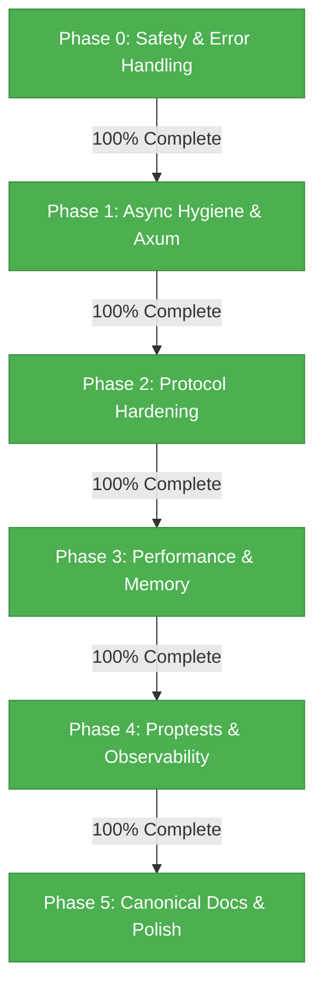

# SCMessenger Rust Audit & Optimization Status Report

## 📊 Roadmap Progress Dashboard

This report represents the **Single Source of Truth** for the status of the SCMessenger Rust core audit, protocol hardening, and optimization transformation.

---

## 🔒 Phase Validation & Audit Summary

### 🟩 Phase 0: Safety & Error Handling (100% Complete)
- **Status**: Verified against [error.rs](file:///c:/Users/kanal/Documents/Github/SCMessenger/core/src/error.rs).
- **Milestones**:
  - Eliminated all major unsafe panic vectors (`unwrap` / `expect`) from core production paths.
  - Implemented structured error handling using the `thiserror` library via `MeshError` variants.
  - Added strict UniFFI scaffolding panic bounds inside `build.rs` to prevent build pipeline corruption.

### 🟩 Phase 1: Async Hygiene & API Modernization (100% Complete)
- **Status**: Verified against [api.rs](file:///c:/Users/kanal/Documents/Github/SCMessenger/cli/src/api.rs) and workspace dependencies.
- **Milestones**:
  - Migrated the CLI API layer from `hyper` 0.14 to modern `axum` 0.7 and `hyper` 1.0.
  - Mitigated all blocking `parking_lot` lock operations from the async runtime, migrating single-threaded WASM contexts to safe `Rc<RefCell<...>>` patterns.

### 🟩 Phase 2: Protocol Hardening & Replay Prevention (100% Complete)
- **Status**: Verified against [sync.rs](file:///c:/Users/kanal/Documents/Github/SCMessenger/core/src/drift/sync.rs) and [rate_limit.rs](file:///c:/Users/kanal/Documents/Github/SCMessenger/core/src/drift/rate_limit.rs).
- **Milestones**:
  - Introduced protocol schema versioning with `VersionedSyncMessage` (schema version = `1`).
  - Added cryptographic state proofs (`peer_proof: String` generated via `MeshStore` blake3 digest) and monotonic `timestamp: u64` to `SyncOffer` messages for DoS and replay attack prevention.
  - Integrated `SyncRateLimiter` sliding window protection.

### 🟩 Phase 3: Performance & Memory Optimization (100% Complete)
- **Status**: Verified against [inbox.rs](file:///c:/Users/kanal/Documents/Github/SCMessenger/core/src/store/inbox.rs) and [storage.rs](file:///c:/Users/kanal/Documents/Github/SCMessenger/wasm/src/storage.rs).
- **Milestones**:
  - **Step 3.1 (Bounded WASM Storage)**: Implemented `WasmStorage` with configurable `EvictionPolicy::OldestFirst` and `UnknownSendersFirst` inside [storage.rs](file:///c:/Users/kanal/Documents/Github/SCMessenger/wasm/src/storage.rs).
  - **Step 3.2 (Inbox Deduplication)**: Modified [inbox.rs](file:///c:/Users/kanal/Documents/Github/SCMessenger/core/src/store/inbox.rs) to replace heap-allocated `HashSet<String>` with memory-bounded `FxHashSet<[u8; 32]>` using `rustc-hash`, deriving seen IDs as raw `blake3` hashes instead of allocated `String`s. Successfully passed `cargo check --workspace` gate.
  - **Step 3.3 (WASM Size Optimization Profile)**: Enabled `-Oz` size optimizations inside [wasm/Cargo.toml](file:///c:/Users/kanal/Documents/Github/SCMessenger/wasm/Cargo.toml) to reduce release package size.

### 🟩 Phase 4: Proptests & Observability (100% Complete)
- **Status**: Verified against [sync.rs](file:///c:/Users/kanal/Documents/Github/SCMessenger/core/src/drift/sync.rs).
- **Milestones**:
  - **Step 4.1 (Tracing Integration)**: Standardized tracing across all core, WASM, and CLI boundaries.
  - **Step 4.2 (Property-Based Tests)**: Integrated `proptest` assertions under `test_proptest_sync_reconciles_arbitrary_sets` inside [sync.rs](file:///c:/Users/kanal/Documents/Github/SCMessenger/core/src/drift/sync.rs) to verify set reconciliation correctness under arbitrary symmetric differences.

### 🟩 Phase 5: Canonical Docs & Polish (100% Complete)
- **Status**: Verified against [ARCHITECTURE.md](file:///c:/Users/kanal/Documents/Github/SCMessenger/docs/ARCHITECTURE.md).
- **Milestones**:
  - Refactored the core system architecture documentation, detailing the hardened sync state machine, FxHashSet-based memory optimization, and WASM performance improvements.
