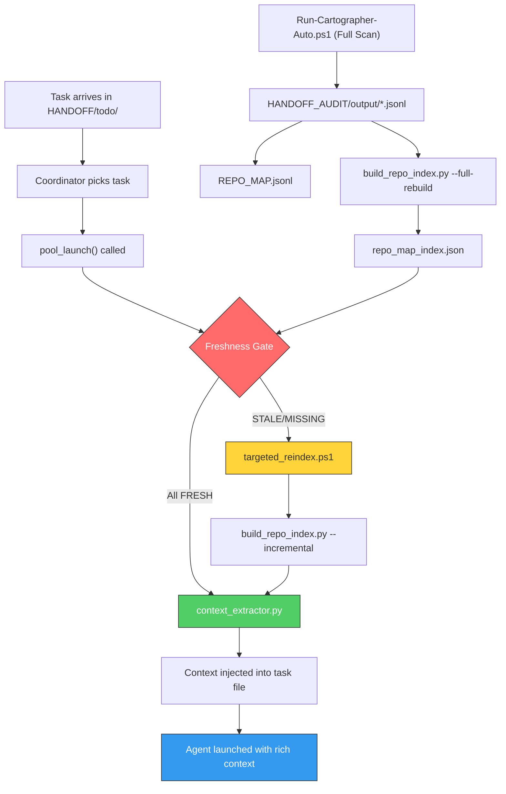

# REPO_MAP ↔ Agent Orchestration Integration

Merge the Cartographer's pre-extracted code intelligence (`REPO_MAP.jsonl`) with the agent orchestration pipeline so that every agent launched against a file receives **precise, verified-fresh context** — function names, line numbers, struct definitions, cross-file call graphs — or triggers an automatic re-index before launch.

## Current State

### System A — Cartographer ("Perfection Engine")
- [Run-Cartographer-Auto.ps1](file:///c:/Users/kanal/Documents/Github/SCMessenger/Run-Cartographer-Auto.ps1) scans the repo, chunks every logic file (350-line chunks), and dispatches each chunk to a local Ollama worker (qwen2.5-coder 1.5b/3b).
- Workers produce JSON chunks stored in `HANDOFF_AUDIT/output/*.jsonl`, aggregated into [REPO_MAP.jsonl](file:///c:/Users/kanal/Documents/Github/SCMessenger/HANDOFF_AUDIT/REPO_MAP.jsonl) (~228KB, 7542 lines, 203 output files).
- Schema per chunk: `{ file, chunk, summary, structs_or_classes, imports, funcs[{name, line, calls_out_to}] }`
- Quality gates: placeholder detection, line-number validation, summary length checks via [surgical_cleanup.py](file:///c:/Users/kanal/Documents/Github/SCMessenger/HANDOFF_AUDIT/surgical_cleanup.py).
- **No timestamp metadata** — the current REPO_MAP has zero information about *when* each file was indexed.

### System B — Agent Orchestration
- [orchestrator_manager.sh](file:///c:/Users/kanal/Documents/Github/SCMessenger/.claude/orchestrator_manager.sh) manages agent lifecycle (max 2 concurrent).
- Agent pool defined in [agent_pool.json](file:///c:/Users/kanal/Documents/Github/SCMessenger/.claude/agent_pool.json) (10 agent profiles, 39 models).
- Tasks flow through `HANDOFF/{todo,IN_PROGRESS,done,review}`.
- [coordinator.md](file:///c:/Users/kanal/Documents/Github/SCMessenger/.claude/prompts/coordinator.md) defines the task classification matrix.
- **No REPO_MAP awareness** — agents currently receive zero pre-extracted code context.

---

## Proposed Changes

### Component 1: REPO_MAP Index Metadata Layer

Build a staleness-tracking index that records *when* each file was last indexed and enables O(1) freshness lookups.

---

#### [NEW] [repo_map_index.json](file:///c:/Users/kanal/Documents/Github/SCMessenger/HANDOFF_AUDIT/repo_map_index.json)

A sidecar metadata file that maps every indexed file to its indexing timestamp and chunk count. Generated and maintained by the indexer.

```json
{
  "version": "1.0",
  "generated_at": "2026-05-04T04:00:00Z",
  "files": {
    "core/src/transport/swarm.rs": {
      "indexed_at": "2026-05-04T03:45:00Z",
      "file_modified_at": "2026-05-03T14:00:00Z",
      "chunks": [1, 2, 3, 4, 5, 6, 7, 8, 9, 10, 11, 12, 13, 14],
      "total_lines": 4900,
      "status": "complete"
    },
    "android/app/src/main/java/.../MeshRepository.kt": {
      "indexed_at": "2026-05-04T03:50:00Z",
      "file_modified_at": "2026-05-02T10:00:00Z",
      "chunks": [1, 2, 3, 4, 5, 6, 7, 8, 9, 10],
      "total_lines": 3500,
      "status": "complete"
    }
  }
}
```

---

#### [NEW] [build_repo_index.py](file:///c:/Users/kanal/Documents/Github/SCMessenger/.claude/scripts/build_repo_index.py)

Generates `repo_map_index.json` from the existing REPO_MAP output files. Two modes:

1. **Full rebuild** — Scans all `HANDOFF_AUDIT/output/*.jsonl` files, extracts the source file path from the done tickets, and records the output file's last-modified timestamp as `indexed_at`. Cross-references against the actual source file's `LastWriteTime` to record `file_modified_at`.

2. **Incremental update** — Called after a single-file re-index completes. Updates only the entry for the re-indexed file.

Key logic:
```python
def build_index():
    index = {"version": "1.0", "generated_at": now_iso(), "files": {}}
    for ticket in done_dir.glob("*.txt"):
        # Extract "FILE: <path>" from ticket content
        file_path = parse_ticket(ticket)
        rel_path = os.path.relpath(file_path, repo_root)
        
        # Derive indexing timestamp from the output jsonl file's mtime
        output_file = output_dir / f"{ticket.stem}.jsonl"
        indexed_at = datetime.fromtimestamp(output_file.stat().st_mtime)
        
        # Get actual file modification time
        file_modified_at = datetime.fromtimestamp(os.path.getmtime(file_path))
        
        # Aggregate chunks per file
        if rel_path not in index["files"]:
            index["files"][rel_path] = {
                "indexed_at": indexed_at.isoformat(),
                "file_modified_at": file_modified_at.isoformat(),
                "chunks": [],
                "total_lines": count_lines(file_path),
                "status": "complete"
            }
        index["files"][rel_path]["chunks"].append(chunk_num)
    
    write_json(index_path, index)
```

---

### Component 2: Staleness Detection Engine

A lightweight query tool that agents and the orchestrator call before launch to determine if the files a task touches have fresh REPO_MAP data.

---

#### [NEW] [freshness_gate.py](file:///c:/Users/kanal/Documents/Github/SCMessenger/.claude/scripts/freshness_gate.py)

Entry point script called by the orchestrator before agent launch. Accepts a list of file paths (or a task file) and returns a freshness verdict.

**Input**: File paths extracted from the task description, or a `file_domains` list from the agent pool config.

**Output**: JSON verdict:
```json
{
  "verdict": "STALE",
  "fresh_files": ["core/src/transport/beacon.rs"],
  "stale_files": [
    {
      "path": "core/src/transport/swarm.rs",
      "indexed_at": "2026-05-03T14:00:00Z",
      "modified_at": "2026-05-04T02:30:00Z",
      "delta_hours": 12.5
    }
  ],
  "missing_files": ["core/src/transport/new_module.rs"],
  "context_payload_path": "HANDOFF_AUDIT/.context_cache/task_abc123.json"
}
```

**Staleness rules**:
1. `file_modified_at > indexed_at` → **STALE** (file changed after last index)
2. File exists on disk but not in `repo_map_index.json` → **MISSING** (never indexed)
3. `indexed_at >= file_modified_at` → **FRESH** (safe to use cached context)

**CLI interface**:
```bash
python .claude/scripts/freshness_gate.py --files "core/src/transport/swarm.rs,core/src/relay/client.rs"
python .claude/scripts/freshness_gate.py --task-file "HANDOFF/todo/IMPLEMENT_RELAY_CUSTODY.md"
python .claude/scripts/freshness_gate.py --agent-domains "core/src/transport/,core/src/relay/"
```

---

### Component 3: Context Injection System

When files are fresh, extract their REPO_MAP data and produce a focused context payload that gets injected into the agent's task prompt.

---

#### [NEW] [context_extractor.py](file:///c:/Users/kanal/Documents/Github/SCMessenger/.claude/scripts/context_extractor.py)

Reads `REPO_MAP.jsonl` and extracts all chunks belonging to the requested files. Produces a compact context document.

**Output format** (written to `HANDOFF_AUDIT/.context_cache/<task_id>.md`):

```markdown
# REPO_MAP Context for Task: IMPLEMENT_RELAY_CUSTODY

## core/src/relay/client.rs (3 chunks, 1050 lines)
### Summary
Relay client implementation with connection pooling and circuit-breaker integration.

### Structs/Classes
- `RelayClient` (line 45)
- `RelayConfig` (line 12)
- `ConnectionPool` (line 89)

### Functions
| Function | Line | Calls Out To |
|----------|------|-------------|
| `connect` | 102 | `ConnectionPool::acquire`, `CircuitBreaker::check` |
| `send_message` | 156 | `encrypt_envelope`, `relay_custody::store` |
| `disconnect` | 210 | `ConnectionPool::release` |

### Imports
- `crate::transport::circuit_breaker::CircuitBreaker`
- `crate::crypto::encrypt::encrypt_envelope`

---

## core/src/relay/relay_custody.rs (7 chunks, 2450 lines)
[... same format ...]
```

> [!IMPORTANT]
> The context document is **appended to the agent's task file** before launch, giving the model exact function names and line numbers. This eliminates guesswork and dramatically reduces hallucinated code references.

---

### Component 4: On-Demand Re-Indexing Pipeline

When stale or missing files are detected, trigger a targeted re-index using the Cartographer before launching the agent.

---

#### [NEW] [targeted_reindex.ps1](file:///c:/Users/kanal/Documents/Github/SCMessenger/.claude/scripts/targeted_reindex.ps1)

A lightweight variant of `Run-Cartographer-Auto.ps1` that re-indexes **specific files only**. Key differences from the full Cartographer:

1. **Single-file targeting** — Accepts a comma-separated list of file paths instead of scanning the whole repo.
2. **Purge-first** — Deletes existing output chunks and done tickets for the targeted files before re-indexing.
3. **Blocking execution** — Runs synchronously (not as a background swarm) since we need the result before agent launch.
4. **Single Ollama instance** — Uses one worker on one port (not a pool), minimizing resource usage.
5. **Index update** — Calls `build_repo_index.py --incremental` after completion.

```powershell
# Usage:
# .\targeted_reindex.ps1 -Files "core\src\transport\swarm.rs,core\src\relay\client.rs"

param(
    [Parameter(Mandatory=$true)]
    [string]$Files,
    [string]$Model = "qwen2.5-coder:3b",
    [int]$Threads = 4,
    [int]$Port = 11470
)
```

**Flow**:
1. Parse file list → validate each file exists
2. For each file: delete `HANDOFF_AUDIT/output/<file>_chunk*.jsonl` and `done/<file>_chunk*.txt`
3. Start single Ollama instance on dedicated port
4. For each file: chunk → dispatch to worker → validate JSON → write output
5. Kill Ollama instance
6. Run `build_repo_index.py --incremental --files <list>`
7. Exit with success/failure code

---

### Component 5: Orchestrator Integration

Wire the freshness gate and context injection into the existing agent launch pipeline.

---

#### [MODIFY] [orchestrator_manager.sh](file:///c:/Users/kanal/Documents/Github/SCMessenger/.claude/orchestrator_manager.sh)

**Changes to `pool_launch()` function** (around line 237):

Insert a pre-launch freshness check between the model validation step and the actual agent spawn:

```bash
pool_launch() {
    # ... existing slot/domain checks ...
    
    # === NEW: REPO_MAP Freshness Gate ===
    if [ -n "$task_file" ] && [ -f "$task_file" ]; then
        echo "Running REPO_MAP Freshness Gate..."
        local freshness_result
        freshness_result=$($PYTHON .claude/scripts/freshness_gate.py --task-file "$task_file" 2>&1)
        local freshness_exit=$?
        
        if [ $freshness_exit -eq 2 ]; then
            # STALE files detected — trigger targeted re-index
            local stale_files=$($PYTHON -c "
import json, sys
result = json.loads(sys.argv[1])
stale = [f['path'] for f in result.get('stale_files', [])]
missing = result.get('missing_files', [])
print(','.join(stale + missing))
" "$freshness_result")
            
            echo "FRESHNESS GATE: Stale files detected. Triggering targeted re-index..."
            echo "Files: $stale_files"
            
            powershell.exe -NoProfile -ExecutionPolicy Bypass \
                -File ".claude/scripts/targeted_reindex.ps1" \
                -Files "$stale_files"
            
            if [ $? -ne 0 ]; then
                echo "WARNING: Targeted re-index failed. Launching agent without fresh context."
            fi
        fi
        
        # Inject context for all FRESH files
        echo "Injecting REPO_MAP context into task..."
        $PYTHON .claude/scripts/context_extractor.py --task-file "$task_file"
    fi
    
    # ... existing model validation and launch logic ...
}
```

---

#### [MODIFY] [coordinator.md](file:///c:/Users/kanal/Documents/Github/SCMessenger/.claude/prompts/coordinator.md)

Add a new section documenting the REPO_MAP integration for the coordinator agent:

```markdown
## REPO_MAP Context Protocol

Before launching any agent that will touch source files:

1. **Freshness Check**: The orchestrator automatically runs the Freshness Gate.
   - If all files are FRESH → context is injected into the task file.
   - If any files are STALE → a targeted re-index runs first.
   - If re-index fails → agent launches with a WARNING flag.

2. **Context Payload**: Fresh files get a detailed context block appended to the task file containing:
   - File summaries
   - Struct/class definitions with line numbers
   - Function signatures with line numbers
   - Cross-file call graphs
   - Import dependencies

3. **Agent Responsibility**: The launched agent MUST:
   - Use the provided line numbers as starting points (not guess locations).
   - Reference the call graph when tracing cross-module dependencies.
   - Flag any discrepancy between REPO_MAP data and actual code (triggers re-index).
```

---

#### [MODIFY] [Run-Cartographer-Auto.ps1](file:///c:/Users/kanal/Documents/Github/SCMessenger/Run-Cartographer-Auto.ps1)

Add a post-completion hook at line 508 (after the "Swarm Audit Complete" message) to auto-build the index:

```powershell
# After existing completion message
Write-Host "[INDEX] Building REPO_MAP index metadata..." -ForegroundColor Cyan
try {
    & python .claude/scripts/build_repo_index.py --full-rebuild
    Write-Host "[INDEX] repo_map_index.json generated successfully." -ForegroundColor Green
} catch {
    Write-Host "[INDEX] WARNING: Failed to build index: $($_.Exception.Message)" -ForegroundColor Yellow
}
```

---

#### [MODIFY] [orchestration_config.json](file:///c:/Users/kanal/Documents/Github/SCMessenger/.claude/orchestration_config.json)

Add REPO_MAP configuration section:

```json
{
  "repo_map": {
    "enabled": true,
    "index_path": "HANDOFF_AUDIT/repo_map_index.json",
    "data_path": "HANDOFF_AUDIT/REPO_MAP.jsonl",
    "output_dir": "HANDOFF_AUDIT/output",
    "context_cache_dir": "HANDOFF_AUDIT/.context_cache",
    "staleness_threshold_hours": 0,
    "auto_reindex_on_stale": true,
    "reindex_model": "qwen2.5-coder:3b",
    "reindex_port": 11470,
    "max_context_lines": 500
  }
}
```

> [!NOTE]
> `staleness_threshold_hours: 0` means ANY modification after indexing triggers a re-index. This can be relaxed to allow a grace period (e.g., `1` hour) if re-indexing frequency becomes excessive.

---

## Architecture Diagram



---

## Open Questions

> [!IMPORTANT]
> **Task File Parsing**: How should the freshness gate extract file paths from task files? Options:
> 1. **Regex scan** — Look for file extensions (`.rs`, `.kt`, `.swift`) in the task text
> 2. **Explicit `FILES:` header** — Require task files to list target files in a structured header
> 3. **Agent `file_domains` mapping** — Use the agent pool's `file_domains` to determine scope
> 
> I recommend **option 3 as primary + option 1 as fallback** — the agent pool already maps agents to file domains, and regex catches any explicitly mentioned files. 

> [!WARNING]
> **Re-index blocking time**: A targeted re-index of a large file (e.g., `swarm.rs` at ~5000 lines = 14 chunks) will take ~3-5 minutes on the 3B model. Should we:
> 1. **Block** — Wait for re-index to complete before launching the agent (safest, but delays launch)
> 2. **Launch with WARNING** — Start the agent immediately but mark context as potentially stale
> 3. **Parallel launch** — Start re-index and agent simultaneously; agent uses stale context initially
> 
> I recommend **option 1** for correctness — the whole point is precise context, and 3-5 min is acceptable overhead.

---

## Verification Plan

### Automated Tests

1. **Index generation test**:
   ```bash
   python .claude/scripts/build_repo_index.py --full-rebuild
   python -c "import json; idx = json.load(open('HANDOFF_AUDIT/repo_map_index.json')); assert len(idx['files']) > 100"
   ```

2. **Freshness detection test**:
   ```bash
   # Touch a file to make it "stale"
   touch core/src/transport/swarm.rs
   python .claude/scripts/freshness_gate.py --files "core/src/transport/swarm.rs"
   # Should return verdict: STALE
   ```

3. **Context extraction test**:
   ```bash
   python .claude/scripts/context_extractor.py --files "core/src/transport/beacon.rs" --output test_context.md
   # Verify output contains function names, line numbers, and struct definitions
   ```

4. **End-to-end integration test**:
   ```bash
   # Create a dummy task file, run the freshness gate, verify context injection
   bash .claude/orchestrator_manager.sh pool launch implementer HANDOFF/todo/TEST_TASK.md
   # Verify the task file was augmented with REPO_MAP context before agent received it
   ```

### Manual Verification
- Run the full Cartographer, then modify 2-3 source files, then launch an agent task targeting those files. Verify that:
  1. The freshness gate detects the stale files
  2. Targeted re-index runs and completes
  3. The agent's task file contains up-to-date context with correct line numbers
