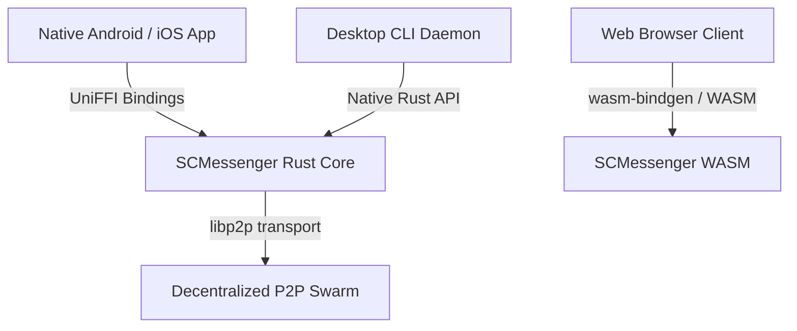

# SCMessenger Core Architecture Guide

Status: Active
Last updated: 2026-05-09

## 📊 System Topology & Design Principles

SCMessenger is a high-performance, sovereign, and decentralized mesh messaging engine built on top of a Rust core library (`scmessenger-core`) with platform adaptors (Android, iOS, CLI, WASM).

---

## 🔒 Hardened Protocol Security & Sync Model

### 1. Hardened Sync Protocol (Drift Protocol)
Set reconciliation is powered by Invertible Bloom Lookup Tables (IBLT) implemented in `core/src/drift/sync.rs`.
- **Schema Versioning**: All sync frames are wrapped in `VersionedSyncMessage` with `SYNC_SCHEMA_VERSION = 1` for forwards/backwards protocol compatibility.
- **DoS & Replay Protection**: `SyncOffer` frames include a cryptographic `peer_proof` (a blake3 state digest generated by `MeshStore`) and a monotonic `timestamp: u64` to prevent playback and amplification attacks.
- **Rate Limiting**: Integrated `SyncRateLimiter` enforces a sliding-window rate boundary per remote Peer ID to suppress flood and spam attacks.

### 2. Inbox Deduplication (FxHashSet Optimization)
To avoid memory exhaustion under heavy relay loads, `Inbox` deduplication in `core/src/store/inbox.rs` uses a stack-allocated, fixed-size structure:
- **String Allocation Avoidance**: Replaced the previous heap-allocated `HashSet<String>` with a highly optimized `FxHashSet<[u8; 32]>` powered by `rustc-hash`.
- **Blake3 Digests**: Deduplicated entries are derived as 32-byte `blake3` message digests rather than dynamically allocated string copies, lowering memory overhead and avoiding GC/allocator latency during bulk message processing.

### 3. Bounded WASM Storage
For browser environments, `WasmStorage` in `wasm/src/storage.rs` enforces hard-capacity bounds and smart eviction policies:
- **Eviction Policies**: Supported policies include `EvictionPolicy::OldestFirst` and `EvictionPolicy::UnknownSendersFirst` (prioritizing the retention of messages from known or trusted contacts under memory pressure).
- **WASM Size Optimizations**: `wasm-opt = ["-Oz"]` enables post-compilation size reduction, stripping unnecessary instructions to minimize web application package overhead.

---

## 🗃️ Workspace Crate Map

- **[scmessenger-core](../core)**: Cryptographic state, identity derivation, outbox queues, and IBLT-based set synchronization.
- **[scmessenger-cli](../cli)**: Axum 0.7-powered daemon and CLI management shell.
- **[scmessenger-wasm](../wasm)**: Thin web client adaptors optimized for browser sandboxes.
