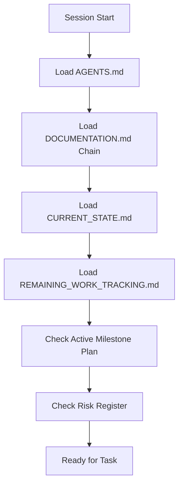

# SCMessenger Roo Code Features Plan

**Status:** Draft  
**Created:** 2026-03-14  
**Repository:** Treystu/SCMessenger

## Executive Summary

This plan outlines a comprehensive strategy to maximize Roo Code capabilities for the SCMessenger project - a decentralized, end-to-end encrypted messenger built with Rust + libp2p targeting Android, iOS, CLI, and WASM.

---

## 1. Custom Modes (.roomodes)

Create project-specific modes to optimize agent behavior for different SCMessenger workflows.

### 1.1 Proposed Modes

```
.roomodes/
├── scm-rust.json           # Rust core development
├── scm-android.json        # Android/Kotlin development  
├── scm-ios.json            # iOS/Swift development
├── scm-protocol.json       # Protocol/crypto review
├── scm-docs.json           # Documentation specialist
├── scm-release.json        # Release verification
└── scm-debug-mesh.json     # Mesh/relay debugging
```

#### 1.1.1 scm-rust Mode

```json
{
  "slug": "scm-rust",
  "name": "🦀 SCM Rust",
  "roleDefinition": "Expert in Rust, libp2p, async/tokio, UniFFI bindings, cryptography with Ed25519/X25519/XChaCha20-Poly1305. Focus on core/, mobile/, wasm/ crates.",
  "customInstructions": "Follow PHILOSOPHY_CANON.md rules. Verify builds with cargo test --workspace. Check api.udl for UniFFI changes. Never modify crypto algorithms.",
  "groups": ["read", "edit", "command"],
  "source": "project"
}
```

#### 1.1.2 scm-android Mode

```json
{
  "slug": "scm-android",
  "name": "🤖 SCM Android",
  "roleDefinition": "Expert in Kotlin/Compose, Android lifecycle, BLE/WiFi-Direct, UniFFI integration. Focus on android/ directory.",
  "customInstructions": "Run ./gradlew assembleDebug after changes. Follow android/README.md patterns. Test on API 35.",
  "groups": ["read", "edit", "command"],
  "source": "project"
}
```

#### 1.1.3 scm-ios Mode

```json
{
  "slug": "scm-ios",
  "name": "🍎 SCM iOS",
  "roleDefinition": "Expert in SwiftUI, iOS lifecycle, BLE/Multipeer, XCFramework integration. Focus on iOS/ directory.",
  "customInstructions": "Verify xcframework bindings match api.udl. Follow iOS/README.md. Test background modes.",
  "groups": ["read", "edit", "command"],
  "source": "project"
}
```

#### 1.1.4 scm-protocol Mode

```json
{
  "slug": "scm-protocol",
  "name": "🔐 SCM Protocol",
  "roleDefinition": "Cryptography and protocol security expert. Reviews envelope format, key exchange, identity model, relay security.",
  "customInstructions": "Reference PHILOSOPHY_CANON.md PHIL-003. Review against docs/PROTOCOL.md. No algorithm substitution.",
  "groups": ["read"],
  "source": "project"
}
```

#### 1.1.5 scm-docs Mode

```json
{
  "slug": "scm-docs",
  "name": "📚 SCM Docs",
  "roleDefinition": "Documentation specialist. Maintains DOCUMENTATION.md chain, CURRENT_STATE.md, REMAINING_WORK_TRACKING.md.",
  "customInstructions": "Run ./scripts/docs_sync_check.sh before completing. Follow DOCUMENT_STATUS_INDEX.md classifications.",
  "groups": ["read", "edit"],
  "source": "project"
}
```

#### 1.1.6 scm-release Mode

```json
{
  "slug": "scm-release",
  "name": "🚀 SCM Release",
  "roleDefinition": "Release verification specialist. Validates builds, interop matrix, parity gates, risk registers.",
  "customInstructions": "Check docs/INTEROP_MATRIX_V0.2.0_ALPHA.md. Verify V0.2.0_RESIDUAL_RISK_REGISTER.md. Run full test suite.",
  "groups": ["read", "command"],
  "source": "project"
}
```

#### 1.1.7 scm-debug-mesh Mode

```json
{
  "slug": "scm-debug-mesh",
  "name": "🕸️ SCM Mesh Debug",
  "roleDefinition": "Mesh networking and relay debugging specialist. Analyzes libp2p swarm, relay flaps, NAT traversal, peer discovery.",
  "customInstructions": "Use scripts/mince_logs.py for analysis. Reference MESH_DEBUG_RCA docs. Check relay/ and transport/ modules.",
  "groups": ["read", "edit", "command"],
  "source": "project"
}
```

---

## 2. Project Rules (.roo/rules)

Create a hierarchy of rules that enforce project standards across all modes.

### 2.1 Directory Structure

```
.roo/
├── rules/
│   ├── 000-critical.md           # Non-negotiable rules
│   ├── 010-documentation.md      # Doc sync requirements
│   ├── 020-crypto.md             # Cryptography constraints
│   ├── 030-platform-parity.md    # Cross-platform rules
│   ├── 040-build-verify.md       # Build verification
│   ├── 050-identity.md           # Identity model rules
│   └── 060-testing.md            # Test requirements
└── rules-scm-rust/
    └── rust-specific.md          # Mode-specific rules
```

### 2.2 Rule Definitions

#### 000-critical.md

```markdown
# Critical Rules - All Modes

## Documentation Sync Mandatory
Every change-bearing run MUST update canonical docs or state why none needed.

## Build Verification Mandatory  
If code/bindings/wiring changes, run appropriate build command before session end.

## Philosophy Canon Enforcement
All work must align with reference/PHILOSOPHY_CANON.md enforceable rules.

## File Storage
NEVER use system /tmp. ALWAYS use repo-local tmp/ directory.
```

#### 020-crypto.md

```markdown
# Cryptography Rules

## Non-Negotiable Algorithms
- Identity: Ed25519
- Identity hash: Blake3
- Key exchange: X25519 ECDH  
- KDF: Blake3 derive_key
- Encryption: XChaCha20-Poly1305
- Auth: Ed25519 signatures + AAD

## NEVER substitute algorithms without explicit owner approval.
## Reference types: IdentityKeys, Envelope, Message in core/src/crypto/
```

#### 050-identity.md

```markdown
# Identity Model Rules

## Canonical Identity
- public_key_hex is canonical for persistence and exchange
- identity_id and libp2p_peer_id are derived metadata
- Reference: PHIL-001 in PHILOSOPHY_CANON.md

## Cross-Platform Requirement
Identity handling MUST be identical across Android, iOS, and Web.
```

---

## 3. Skills Expansion (skills/)

Expand the skills directory beyond philosophy-enforcer.

### 3.1 Proposed Skills

```
skills/
├── philosophy-enforcer/      # Existing
├── platform-parity-check/    # Cross-platform verification
├── release-gate-validator/   # Release readiness
├── mesh-diagnostics/         # Network troubleshooting
├── crypto-audit/             # Security review
└── doc-sync-enforcer/        # Documentation compliance
```

#### 3.1.1 platform-parity-check

```markdown
---
name: platform-parity-check
description: Verify feature parity across Android, iOS, and Web/WASM for critical controls
---

# Platform Parity Check Skill

## Purpose
Ensure critical-path behavior is identical across all platforms per PHIL-006 and PHIL-010.

## Workflow
1. Identify the feature or control being checked
2. Verify implementation exists in: android/, iOS/, wasm/
3. Compare behavior against core/ contract
4. Check UniFFI binding alignment (api.udl)
5. Generate parity matrix report

## Verification Points
- Relay ON/OFF semantics identical
- Identity display/exchange identical  
- Send/receive flow identical
- Settings/preferences aligned
- Error handling consistent

## Output
- PASS: All platforms aligned
- PARTIAL: Gaps identified with remediation
- FAIL: Critical divergence found
```

#### 3.1.2 release-gate-validator

```markdown
---
name: release-gate-validator
description: Validate release readiness against milestone criteria and risk registers
---

# Release Gate Validator Skill

## Workflow
1. Load active milestone plan (docs/MILESTONE_PLAN_V0.2.0_ALPHA.md)
2. Check all gates marked complete
3. Verify residual risk register status
4. Run interop matrix validation
5. Confirm build verification passes
6. Check documentation chain is current

## Required Checks
- cargo test --workspace passes
- ./gradlew assembleDebug passes
- iOS archive builds
- Interop matrix gates green
- Risk register items addressed or accepted
- REMAINING_WORK_TRACKING.md current

## Output
- Release candidate status
- Blocking issues list
- Risk acceptance requirements
```

#### 3.1.3 mesh-diagnostics

```markdown
---
name: mesh-diagnostics
description: Diagnose libp2p mesh, relay, and NAT traversal issues
---

# Mesh Diagnostics Skill

## Use When
- Peer discovery fails
- Relay connections flap
- NAT traversal issues
- Message delivery failures

## Diagnostic Steps
1. Collect logs with scripts/comprehensive_log_capture.sh
2. Parse with scripts/mince_logs.py
3. Check relay flap windows with scripts/correlate_relay_flap_windows.sh
4. Verify bootstrap connectivity
5. Check NAT/reflection status

## Key Modules
- core/src/transport/ - Swarm behavior
- core/src/relay/ - Relay protocol
- core/src/routing/ - Routing engines

## Output
- Root cause analysis
- Remediation steps
- Configuration recommendations
```

---

## 4. Context Management Strategy

### 4.1 Memory Bank Structure

Create structured context files for persistent project knowledge.

```
.roo/
├── memory-bank/
│   ├── projectbrief.md           # Project overview
│   ├── productContext.md         # Product decisions
│   ├── systemPatterns.md         # Architecture patterns
│   ├── techContext.md            # Technology stack
│   ├── activeContext.md          # Current focus
│   └── progress.md               # Implementation status
```

#### projectbrief.md

```markdown
# SCMessenger Project Brief

## Mission
Build a sovereign, E2E-encrypted messenger with no accounts, servers, or phone numbers.

## Platforms
- Android (Kotlin/Compose + UniFFI)
- iOS (SwiftUI + UniFFI)  
- CLI (Rust native)
- Web/WASM (future)

## Current State
- v0.2.0 alpha baseline
- WS13/WS14 planned for v0.2.1

## Key Constraints
- Crypto is non-negotiable (Ed25519/X25519/XChaCha20)
- Platform parity required before GA
- Community-operated infrastructure model
```

### 4.2 Context Loading Strategy



---

## 5. Indexing Strategy

### 5.1 Priority Indexing Paths

Configure Roo Code to prioritize indexing of critical paths:

```
High Priority:
- core/src/lib.rs
- core/src/api.udl
- core/src/crypto/**
- core/src/identity/**
- core/src/transport/**
- mobile/src/**

Medium Priority:
- android/app/src/main/**
- iOS/SCMessenger/**
- cli/src/**
- wasm/src/**

Lower Priority:
- docs/**
- reference/**
- scripts/**
```

### 5.2 Ignore Patterns

```
Exclude from indexing:
- **/build/**
- **/target/**
- **/.gradle/**
- **/node_modules/**
- SCMessengerCore.xcframework/**/*.a
- validation_logs_*/**
- tmp/**
```

### 5.3 Symbol Indexing Focus

```yaml
primary_symbols:
  - IronCore                 # Main API facade
  - SwarmHandle              # Transport handle
  - Envelope                 # Message format
  - IdentityKeys             # Key management
  - Contact                  # Contact type
  - ContactManager           # Contact operations
  - RelayClient              # Relay protocol
  - DriftProtocol            # Drift protocol

cross_platform_bindings:
  - api.udl                  # UniFFI contract
  - contacts_bridge.rs       # Contact bindings
  - mobile_bridge.rs         # Mobile bindings
```

---

## 6. MCP Server Integration

### 6.1 Potential MCP Servers

Consider integrating MCP servers for enhanced capabilities:

| Server | Purpose | Use Case |
|--------|---------|----------|
| filesystem | File operations | Standard |
| git | Git operations | Version control |
| github | GitHub API | Issues, PRs |
| memory | Persistent memory | Session context |
| sequential-thinking | Complex reasoning | Architecture decisions |

### 6.2 Custom MCP Server Opportunity

Create a project-specific MCP server for:
- Build status checking across platforms
- Interop matrix queries
- Documentation chain validation
- Risk register status

---

## 7. Integration with Existing Infrastructure

### 7.1 Alignment with AGENTS.md

The new Roo configuration aligns with existing AGENTS.md requirements:

| AGENTS.md Requirement | Roo Implementation |
|----------------------|-------------------|
| Documentation sync mandatory | Rule 010-documentation.md |
| Build verification mandatory | Rule 040-build-verify.md |
| Required docs touchpoints | Context loading strategy |
| Docs sync check script | Integrated in mode instructions |

### 7.2 Alignment with PHILOSOPHY_CANON.md

| Canon Rule | Roo Implementation |
|------------|-------------------|
| PHIL-001 Identity | Rule 050-identity.md |
| PHIL-002 Relay semantics | platform-parity-check skill |
| PHIL-003 Crypto authority | Rule 020-crypto.md |
| PHIL-006 Platform parity | scm-release mode |

---

## 8. Implementation Checklist

### Phase 1: Foundation
- [ ] Create .roomodes/ directory
- [ ] Add scm-rust.json, scm-android.json, scm-ios.json modes
- [ ] Create .roo/rules/ directory structure
- [ ] Add 000-critical.md, 020-crypto.md, 050-identity.md rules

### Phase 2: Skills
- [ ] Create platform-parity-check skill
- [ ] Create release-gate-validator skill
- [ ] Create mesh-diagnostics skill
- [ ] Test skill invocation

### Phase 3: Context
- [ ] Create .roo/memory-bank/ structure
- [ ] Populate projectbrief.md and techContext.md
- [ ] Test context loading workflow

### Phase 4: Integration
- [ ] Verify modes align with AGENTS.md
- [ ] Verify rules align with PHILOSOPHY_CANON.md
- [ ] Test full workflow: mode + rules + skills
- [ ] Document in DOCUMENTATION.md

---

## 9. File Deliverables Summary

```
New files to create:
├── .roomodes/
│   ├── scm-rust.json
│   ├── scm-android.json
│   ├── scm-ios.json
│   ├── scm-protocol.json
│   ├── scm-docs.json
│   ├── scm-release.json
│   └── scm-debug-mesh.json
├── .roo/
│   ├── rules/
│   │   ├── 000-critical.md
│   │   ├── 010-documentation.md
│   │   ├── 020-crypto.md
│   │   ├── 030-platform-parity.md
│   │   ├── 040-build-verify.md
│   │   ├── 050-identity.md
│   │   └── 060-testing.md
│   └── memory-bank/
│       ├── projectbrief.md
│       ├── techContext.md
│       └── activeContext.md
└── skills/
    ├── platform-parity-check/
    │   └── SKILL.md
    ├── release-gate-validator/
    │   └── SKILL.md
    └── mesh-diagnostics/
        └── SKILL.md
```

---

## 10. Success Criteria

1. **Mode Coverage**: All major development workflows have a dedicated mode
2. **Rule Enforcement**: Critical project constraints enforced via rules
3. **Skill Availability**: Common verification tasks available as skills
4. **Context Efficiency**: Agents load project context automatically
5. **Alignment**: Full alignment with existing AGENTS.md and PHILOSOPHY_CANON.md
